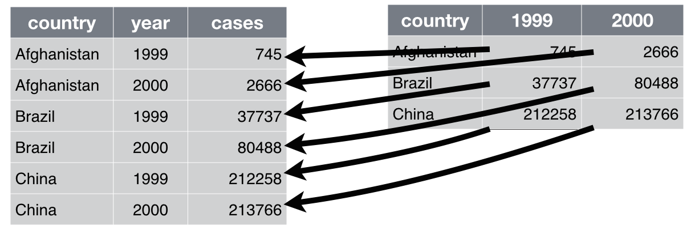

<script>
  (function(i,s,o,g,r,a,m){i['GoogleAnalyticsObject']=r;i[r]=i[r]||function(){
  (i[r].q=i[r].q||[]).push(arguments)},i[r].l=1*new Date();a=s.createElement(o),
  m=s.getElementsByTagName(o)[0];a.async=1;a.src=g;m.parentNode.insertBefore(a,m)
  })(window,document,'script','https://www.google-analytics.com/analytics.js','ga');

  ga('create', 'UA-80486908-1', 'auto');
  ga('send', 'pageview');

</script>

```{r knitr_init, echo=FALSE, cache=FALSE}
library(knitr)
library(rmdformats)

## Global options
options(max.print="75")
opts_chunk$set(echo=TRUE,
	             cache=TRUE,
               prompt=FALSE,
#               tidy=TRUE,
               comment=NA,
               message=TRUE,
               warning=TRUE)
opts_knit$set(width=75)
```

# Préambule

Cette documentation est le fruit d'un travail collaboratif, réalisé par les participants à [la formation organisée par Open Data France et datactivi.st](http://www.datactivi.st/formation.html). Un grand merci à eux !

Elle accompagne les supports de formation suivants :

- les [slides de la première journée](./jour1.html)
- les [slides de la deuxième journée](./jour2.html)
- les [slides de la troisième journée](./jour3.html)
- le [script R](https://github.com/datactivist/IntroR_ODF/blob/master/script.R) reprenant les principales manipulations de données effectuées durant ces trois jours.

La documentation correspondant au module suivant, "Utiliser R pour l’analyse et la visualisation de données", peut être [retrouvée ici](./index2.html).

L'ensemble de ces matériaux peut être retrouvé sur le [repo github dédié](https://github.com/datactivist/IntroR_ODF).

L'ensemble de ces matériaux est placé, sauf mention contraire, sous [licence Creative Commons CC-BY-SA](https://creativecommons.org/licenses/by-sa/4.0/).

# Les matériaux nécessaires pour cette formation

- Une bonne connexion internet pour tous
- Un ordinateur par personne
- Toute la documentation de la formation : www.github.com/datactivist/introR_ODF

Pour le formateur : 

- préparer les démo

# Les étapes de la formation : 

## Première démo : 

Les participants renseignent le formulaire (http://frama.link/formationR) qui demande des informations basiques sur les participants. 
Ce formulaire sert de démonstration des usages potentiels de R. 

Comment connecter un simple formulaire Google Form, ses données récoltées dans un tableur et les visualiser très simplement avec des petits modules de graphes ou de cartes sur une page HTML construite automatiquement. 

Le formateur a créé préalablement [un code R](https://github.com/datactivist/IntroR_ODF/blob/master/dashboard.Rmd) qui permet de visualiser en temps réel [un dashboard](./dashboard.html) qui présente les résultats. 

La force de R, c'est de permettre d'utiliser un code simple et concis (70 lignes dans ce cas). Il faut une heure à une heure et demi pour l'écrire.

## La donnée ?

Selon vous, qu'est ce qu'une donnée ? 

- Quantification
- Une couleur c'est une donnée
- Une information pas forcément lisible immédiatement, lisible par un logiciel
- Lisible par un humain
- Textuel ou numérique
- Une information structurée
- Quantification / Qualification d'un phénomène 
- La loi (CRPA)  : donnée, lisible par machine

- Définition inclusive ==/== restrictive
- « Ce qui n’est pas considéré comme une donnée est une donnée »

Comment ouvrir des données et se demander lesquelles sont à ouvrir ou pas?

Ile de France: Les agents doivent se justifier en cas d'un refus d'ouverture de données. 

Avec la Loi pour une République Numérique, cette question de ce qu’est une donnée va devenir de plus en plus importante.  

R est plus ou moins bien adapté pour traiter certains types/formats, il va falloir donc savoir à l'avance lesquelles vont représenter plus de travail ou pas à traiter avec R

> [« Raw data is an oxymoron »](https://mitpress.mit.edu/books/raw-data-oxymoron) / les données brutes sont un oxymore. 

RUSSELL ACKOFF - Théoricien des systèmes & cybernétique 

« Il faut que l’information circule pour qu’elle ne disparaisse pas. »
Sa vision: Les données seraient brutes par essence.
Si on ouvre les données, on va créer plus de savoir et plus de sagesse. 

Notion de données, 2 dimensions : 

- pas de condition de véracité (Rosenberg, 2013) 
- point de départ de nouveaux réseaux sociotechniques
    
Les données sont obtenues : « Décidément, on ne devrait jamais parler de “données”, mais toujours d’“obtenues”. »  Bruno Latour, 1993

En statistiques, la définition de la donnée varie un peu selon le cadre conceptuel et philosophique. D'un côté, les fréquentistes, pour qui on peut tester la véracité d'énoncés au moyen d'expériences et de tests statistiques. Chaque épreuve se déroule indépendamment des croyances ou connaissances préalables. Pour les bayésiens, au contraire, il y a beaucoup plus de doutes à avoir vis-à-vis de l'objectivation du monde, c'est une approche beaucoup moins naïve qui porte sur la quantification des croyances sur le monde, qui intègre les croyances ou connaissances qu'on a déjà. Dans ce contexte, les données permettent de mettre à jour ces croyances mais n'en sont pas radicalement distinctes.


## Qu'est ce que l'open data ?

Voir la définition de l'[Open Definition](http://opendefinition.org/od/1.1/fr/)

OD : données réutilisables dans des formats techniques et juridiques (2 licences : Licence Ouverte (citer la source - BY) et ODbL (citer la source + partager à l'identique : BY - SA)).

Les données sont généralement gratuites.

Réutilisation par tous, pour toutes formes d'usages.

Lisibles par machines.

Principes: 

- Données accessibles
- Format ouvert
- Usage: attribuer à la source et redistribuer à l’identique 


## Qu'est ce que le big data ?

[](http://gph.is/29aDePB)

Big Data : [règle des 3 V](http://www.journaldunet.com/solutions/expert/51696/les-3-v-du-big-data---volume--vitesse-et-variete.shtml) (Vélocité, Volume, Variété) : hors des GAFA, on rencontre rarement des données massives qui respectent ces trois critères. Voir [cet article de Samuel Goëta](http://www.cairn.info/revue-informations-sociales-2015-5-page-26.htm) qui permet de bien distinguer open data et big data.
Ces données ne sont en général pas ouvertes, c'est un trésor bien gardé des organisations. 

## Qu'est ce que le linked data ?

Web Sémantique proposé par Tim Berners-Lee (4ème et 5ème étoiles du [modèle 5* de T. Berners-Lee](http://5stardata.info/en/)).
Données liées, Données décrites dans des vocabulaires, des nomenclatures. Encore considéré comme une utopie, le Linked Data demeure malgré tout un objectif qualitatif intéressant

Un outil intéressant pour se rappeler des 5 * : [le mug](http://www.cafepress.com/w3c_shop.597992118) ! 


## Pourquoi s’intéresser à l'analyse des données ? 

La maîtrise de l'information est un élément essentiel du rapport au pouvoir (empowerment, donnée de capacités d'action)

- Professionnellement
- Personnellement, mouvement du [self data](http://mesinfos.fing.org/) : données pour reprise en main de certaines parties de sa vie. 

[](http://mesinfos.fing.org/selfdata/)

- Littératie de donnée 
- En tant que citoyen, déconstruire les algorithmes et se réapproprier les données qui servent à la décision publique

Les données ne signifient rien à l'état brut. C'est un modèle qui permet de les interpréter : on fait des hypothèses sur le rapport des données avec la réalité et on donne du sens aux données pour confirmer/infirmer ce modèle. 


Tout modèle vient avec des postulats. Il y a toujours un modèle. Quand il n'y en a pas, il est implicite. 

Il faut donc expliciter nos modèles. Ex. de la taille : si je fais la moyenne, il faut que la distribution soit unimodale (il y a une seule valeur maximale). Si on fait la moyenne des tailles dans cette salle, c'est bimodal puisqu'il y a deux distributions différentes de la taille : les hommes et les femmes (la courbe de taille prendra la forme d'un chapeau mou avec 2 pics). La moyenne n'a aucun sens dans ce cas, ne correspond pas à une valeur interprétable. Dans ce contexte, calculer la moyenne n'a pas d'intérêt, il faut expliciter son modèle et l'adapter aux cas. La moyenne est un indicateur adapté lorsque la distribution est à peu près normale (en courbe de Gauss).

S'initier à l'analyse de données, c'est apprendre à expliciter ses modèles, formuler les hypothèses sous-jacentes, les tester. 
Les aller-retours entre visualisations et modèle permettent de mieux préciser sa démarche. 
Référence : [Edward Tufte](https://fr.wikipedia.org/wiki/Edward_Tufte)

In fine, il s'agit d'appréhender ses données de manière moins naïve. 

Le workflow de l'analyse de données : 

[](http://r4ds.had.co.nz/explore-intro.html)

En amont, import et nettoyage (phases souvent très consommatrices en temps); en aval, communication.

Importer -> Nettoyer -> Transformer -> Visualiser -> Modéliser -> Communiquer

De Transformer à Modéliser : peut être une boucle jusqu’à obtention d'un résultat satisfaisant.

## Et vous pourquoi ça vous intéresse ?
 
Eléments de réponse fournis :

   *  Se doter de méthodes / outils de nettoyage et transformation
   *  Mieux faire parler des données brutes, utiliser davantage nos propres données
   *  Élargir la palette d'outils d'analyse de données
   *  Trouver une manière de rassembler des méthodes ou outils aujourd'hui utilisés par des services différents
   *  Faciliter les croisements de données
   *  Coordonner transversalement des personnes qui utilisent déjà des données (BI, SIG, ...)
   
R : outil fonctionnant en ligne de commandes -> on documente ce qu'on fait, ce qui facilite la reproductibilité des différentes composantes du workflow ci-dessus (gain en efficacité).
 
## L'écosystème des données

Outils déjà utilisés par les participants :

   * Excel / Calc / tableur classique
   * SPSS, SPAD
   * Tableau
   * BO
   * Open Refine (utilisation pour du nettoyage de données ou du géocodage) : www.openrefine.org 
   * CartoDB (visualisation)
   * ESRI, QGis, MapInfo (carto)

Formats de données :


   * tabulaires (voir [RIO (R Input Output)](https://cran.r-project.org/web/packages/rio/vignettes/rio.html))
   * Excel / tableurs
   * formats texte (csv, tsv, csvy, psv, fwf) : ont l'avantage d'être publiquement documentés et relativement facilement exploitables par des machines. Moins facile à lire pour les humains
   * Datapackages : format standardisé proposé par OpenKnowledge (csv avec métadonnées en JSON pour le tabulaire), mais encore peu répandu (quelques usages significatifs sur des thématiques ciblées comme les marchés publics)
   * feather : format d'échange entre R et Python par ex. Avantage : lecture/écriture disque très rapide. Très prometteur lorsqu'il y a des échanges de gros volumes de données entre plusieurs langages
   * formats propriétaires dans le domaine des statistiques :
       * .dta
       * .sav, .por 
       * .dbf (attention, versions incompatibles entre elles)
       * .sas7bdat, .xpt
       * ...
   * Formats plus exotiques :
       * XML
       * HTML
       * JSON (la bascule vers des données tabulaires n'est pas triviale)
       * YAML (souvent utilisé pour stocker des méta-données)
       * ...
   * Formats spécialisés
       * Exemple des données spatiales :
           * GDAL et sa version R ([RGDAL](http://rgdal.sourceforge.net/) : gère 132 formats)
           * Shapefile (format propriétaire qui s'est imposé comme le standard malgré ses nombreux défauts : pas très bien documenté avec des limitations qui nuisent à l'intelligibilité)
           * GeoJSON : format ouvert, texte
           * topojson : format de données spatiales topologiques (intéressant à plusieurs points de vue)
           * kml (xml spécialisé en données spatiales)
           * mapinfo
           * formats raster (stockage plus économique que les formats vectoriels mais dégradation de la qualité lors des zooms)
           * tiles
           * ...

Bases de données :

   * Surtout intéressantes sur de la donnée chaude (i.e. susceptible de changer souvent)
   * Bases relationnelles / SQL (orientées ligne, c'est-à-dire adaptées pour insérer, lire, mettre à jour des lignes de données) : leur performance est fortement corrélée à la manière dont les données sont indexées, ce qui est un inconvénient car il faut avoir très bien pensé son système et ses usages avant de le mettre en oeuvre
       * MySQL
       * SQLite (pour des volumes pas trop importants, bien adapté pour de l'électronique embarquée)
       * PostgresSQL : capacité de gestion spatiale intéressante (PostGIS) mais complexité d'administration
       * ...
   * Bases SQL orientées colonnes : elles sont optimisées pour lire des colonnes, adaptées pour des analyses globales sur l'ensemble du contenu d'une base
       * MonetDB, [MonetDBLite](https://www.monetdb.org/blog/monetdblite-r) (utilisable dans R sans installation externe et performante, l'indexation s'effectuant à la volée)
       * ...
   * Bases NoSQL : bases qui ne reposent pas seulement sur une logique SQL ou tabulaire (a priori, on peut avoir différents types de données : fichiers, images, textes, etc.). Théoriquement, il n'est pas nécessaire de connaître le schéma de la table (possibilité de modifications du schéma de données en cours de route). Du coup, l'indexation est moins efficace que sur des bases SQL, ce qui amène des acteurs à mélanger des bases NoSQL et SQL pour répondre à ce souci
       * MongoDB
       * Cassandra
       * CouchDB
       * SimpleDB
       * BigTable
       * HBase
       * Neo4J (base orientée graphe : les enregistrements stockés sont connectés les uns aux autres)
       * Redis
       * ...

Les API : moyen de communication entre 2 machines - https://fr.wikipedia.org/wiki/Interface_de_programmation

Beaucoup de formats de données et de types des bases de données, d'où de nombreux outils d'exploitation des données ...

## Les outils

Ceux qu'on a l'habitude d'utiliser  ou que tout le monde connaît :

   * Excel, LibreOffice, un tableur quelconque
       * Inconvénients : se présentent comme des outils gérant des données tabulaires mais mélangent des éléments très hétérogènes, ce qui rend les données issues de ce type d'outils difficilement exploitables par des machines. Aujourd'hui, cela conduit à l'apparition [d'outils](http://comma-chameleon.io/) qui gèrent réellement des données tabulaires avec des interfaces graphiques csv

Outils avec interface graphique (GUI)

   * Sphinx
   * SPSS
   * SAS : qualité reconnue (outil préférentiel de l'INSEE jusqu'à présent; coûte très cher)
   * OpenRefine
   * [WTF CSV](https://www.databasic.io/en/wtfcsv/) : permet d'avoir une 1ère vision du contenu d'un fichier CSV sans entrer dans un outil comme R
   * Tableau : permet de faire de la belle dataviz, mais propriétaire
   
Outils avec une interface en lignes de commande (CLI)

   * Python
   * Julia (courbe très ascendante pour ce langage encore très jeune)
   * R
   * C/C++ (une tendance actuelle dans l'utilisation de R est d'écrire les algos les plus gourmands en C++)
   * Java
   * Javascript : langage interprété dont les utilisations se sont étendues
   * outils bash : outils qui peuvent demeurer performants mais très mals documentés et difficiles à utiliser
   
Tous ces outils CLI s'interfacent très bien avec R.

Outils spécialisés. Ex: cas de la cartographie :

   * QGis : lourd à mettre en oeuvre
   * [PhilCarto](http://philcarto.free.fr/) : permet de réaliser de la cartographie thématique. Mérite le coup d'oeil, mais mets des lunettes 80's ;-). Propriétaire.
   * MapInfo
   * ArcGIS
   * Umap : bien adapté pour les débutants.
   * Leaflet : librairie Javascript permettant de faire de la cartographie (s'interface bien avec R)
   
## Les infrastructures

Celles qui se développent dans le Big Data (utilisent la parallélisation pour optimiser les traitements de données et distribuer les stockages de celles-ci) :

- Hadoop
- Spark
- H20
- ...

## One tool to rule them all

Un outil, R, pour aller visiter l'ensemble de ces univers.
Initialement conçu pour la manipulation des données.

R prend la suite de S : langage de haut niveau (= proche d'un langage compréhensible par l'homme mais relativement inefficace en terme de performances)

S langage développé dans les Bell Labs.
R a été développé à l'origine par des universitaires statisticiens, pour répondre à leurs besoins, sans restrictions de licences (-> caractère libre)
Le développement historique de R s'est opéré par l'intermédiaire des packages (décentralisés) développés autour du coeur du langage (qui est demeuré très stable depuis le départ). 
R est devenu leader incontesté dans le domaine des statistiques avec une forte communauté internationale.
Au fil du temps, il est devenu un outil à vocation généraliste (dév. Web, machine learning, etc.). Par ailleurs, il permet d'interfacer de nombreux outils spécialisés (grâce à l'appel de librairies).

Énormément de ressources disponibles (souvent en anglais même si la communauté et les ressources françaises se développent). Une petite sélection :

   * Un livre sur R : [R for Data Science](http://r4ds.had.co.nz) de Garrett Grolemund et Hadley Wickham (rock star de R)
   * blogs : \url{https://www.r-bloggers.com}
   * des listes de diffusion thématiques
   * un site de Q/R communautaires : http://stackoverflow.com/tagged/r
   * twitter avec le hashtag #Rstats
   
   
Une communauté [bienveillance avec les femmes](https://rladies.org/).

Une syntaxe de plus en plus facile

[Des progrès vers du GUI](https://rstudio.github.io/rstudioaddins/)


## C'est quoi tes données?

Les questions auxquelles il faut savoir répondre : 

- domaine
- format
- taille
- granularité
- fraîcheur
- quelle analyse veut-on en faire

# Installation de R

   * [Installation de R](https://cloud.r-project.org/)
   * Sous windows télécharger [R Tools](https://cran.r-project.org/bin/windows/Rtools/)
   * Sous MacOS X il faut probablement [installer les "command line tools" ou un compilateur gcc](https://github.com/kennethreitz/osx-gcc-installer) (pour pouvoir compiler des packages lorsque nécessaire)
   * Installer ensuite [Rstudio](https://www.rstudio.com/products/rstudio/download/preview/)
   
## Installation du tidyverse

Qu'est ce que le `tidyverse` ?

   * Le tidyverse est une suite de packages qui ont pour objet d'opérationnaliser le cycle d'analyse, depuis l'import des données jusqu'à leur représentation finale en passant par toute les étapes. Il a été développé par Hadley Wickham, connu essentiellement par son prénom dans la communauté (c'est un personnage important !). Parfois surnommé "hadleyverse" tant il est renommé, Hadley a demandé à ce qu'il soit nommé tidyverse pour valoriser la communauté et insister sur la notion de *tidy data*.  
   * Liste des packages du tidyverse : broom, DBI, dplyr, forcats, ggplot2, haven, httr, hms, jsonlite, lubridate, magrittr, modelr, purrr, readr, readxl, stringr, tibble, rvest, tidyr, xml2 (https://cran.r-project.org/web/packages/tidyverse/index.html). 
   * Pour installer le tidyverse, entrez dans la console : `install.packages("tidyverse")` puis appuyer sur entrée. 
       * Si un warning s'affiche en précisant que le package n'est pas sous forme binaire, spécifier l'argument `type="source"` dans l'appel à la fonction `install.packages()`
       * Au passage, on voit que RStudio apporte une couche d'assistance en proposant les arguments de la fonction `install.packages`
       * Si le bouton "Stop" (en haut à droite de la console de Rstudio) est affiché et que le symbole « > » (invite de commande) n'est pas affiché, cela signifie que R continue de travailler. 
   * Quand c’est terminé on a le texte : *The downloaded binary packages are in C:\Users\name_user\AppData\Local\Temp\RtmpCgQOmA\downloaded_packages* (ou équivalent)
   * L’invite de commande est revenue : c’est ce symbole en début de ligne : « > »
   * Il est également possible d'installer des packages individuellement via Rstudio (bouton Install à droite de l'IHM). Logique de R : tout peut être fait en lignes de commande.

## Lancement du tidyverse : 

   * Taper library(tidyverse), R Studio propose tidyverse. Si la console affiche des conflits, ne pas en tenir compte (tidyverse informe simplement à titre préventif). 

# Vocabulaire de R

   * *Package* = bouts de code stockés sur le disque dur. Si on veut utiliser fonctions de ces packages, on va charger les packages : R va lire le code qui est contenu dans le package. Le code des packages est approuvé par la communauté avec des contrôles de qualité automatisés pour vérifier leur fonctionnement. De plus en plus de packages ne sont pas publiés sur CRAN (officiel) mais passent par Github où il n'y a pas le contrôle qualité (démarche entièrement "libre").
   * *Logiciel interprété* : chaque ligne de commande est exécutée séquentiellement. On envoie une ligne de commande, l'ordinateur l'interprète et l'éxécute. Après, on peut reprendre la main.
   * `library` permet de charger en mémoire un package et rendre disponible les fonctions. 
   * *Environnement* : tous les objets que nous allons utiliser dans R. 
   * L'historique reprend les différentes instructions qui ont été tapés dans le terminal. 
   * Script : fichier texte ave des instructions pour R.
   
# Commandes de R

Tout ce qu'on utilise dans R : des fonctions  et des données

   * `library` : chargement d'un packages
   * `rm` : suppression d'un objet
   * `glimpse` : pré-visualiser un jeu de données
   
# Interface de R Studio

   * La console (généralement en bas à gauche) : fenêtre essentielle, exactement la même chose que si vous le lanciez dans un Terminal (en tapant R en ligne de commande), l'interface basique pour échanger avec un ordinateur. Le terminal permet de taper du texte et de voir la réponse de l'ordinateur. 
   * Possibilité de changer les couleurs de l'interface de R Studio : aller  dans onglet Options/Apparences.
   * Global Environment (en haut à droite) > contient tous les objets /fonctions  que l'on va utiliser dans R
   * L'onglet "Packages" (en bas à droite) contient la liste de tous les packages installés, et permet d'en installer d'autres. On peut voir ceux qui sont chargés (cochés) et ceux qui ne le sont pas (case vide) 
   * Onglet History (en haut à droite) : historique des commandes exécutées (historique recherchable, ce qui facilite la récupération d'anciennes commandes)
   * Onglet Files (en bas à droite) qui est un explorateur de fichiers de l'ordinateur. Par défaut, affiche le chemin du dossier de travail (working directory), le dossier du disque dur dans lequel R travaille.  
   * Plots (en bas à droite) : Affiche les graphiques 
   * L'onglet Help (en bas à droite) sert à rechercher toutes les fonctions documentées sur lesquelles on trouve un premier niveau d'aide. Documentation donne les arguments possibles de chaque package ou programmeet décrit le fonctionnement de ces arguments avec des exemples d'appels de fonctions . 
   * Onglet Viewer (en vas à droite) : permet de visualiser les pages HTML  et Javascript. 
   
# Scripts et projets sur R


   * Ajout d'un nouveau script : bouton en haut à droite avec la petite croix > Add a R script. 
       * Bonne pratique : Ne jamais écrire dans la console (pour ne pas perdre l'historique de mes actions).
   * Le script contient de la colaration syntaxique qui permet de mieux comprendre son code. 
   * Bonne pratique : une nouvelle ligne = une nouvelle instruction 
   * Il y a des packages de données, entrer `library(airlines)` dans le script par exemple. 

   * Les scripts s'enregistrent et se sauvegardent mais contrairement à la console, il ne se passe rien directement. 

   * `library(tidyverse)` dans le script et appuyer sur ctrl-entrée (Windows, Linux) ou pomme-entrée (Mac). Possibilité aussi d'appuyer sur le bouton Run => exécute l'instruction (ligne par ligne).

   * Projet dans RStudio : crée un environnement dédié dans lequel on a les données, les scripts, l'historique.
       * Bonne pratique : travailler toujours  dans un projet puisque c'est uniquement dans un "projet" qu'on pourra avoir un historique 

   * "New directory" : on définit le répertoire dans lequel les différents éléments du projet (scripts, fonctions, données) seront stockés
   * "Existing directory" : ouvrir un projet déjà existant
   * "Version control" : suivre méthodiquement en comparant les différentes versions successives des fichiers textes. L'outil le plus répandu pour ça pour Git. Plateforme la plus connue : github (mais Dropbox  fait du controle de version). Controle de version n'écrase pas les versions, en cas d'accident, on peut revenir en arrière : tous les états successifs sont stockés. Les projets peuvent être collaboratifs, on peut documenter qui a fait quoi, qui a écrit telle ligne et permet de créditer les contributeurs. 
       * Bonne pratique : soumettre son code à un versioning. Une sauvegarde s'appelle un "Commit". On peut commenter les versions pour suivre l'évolution du projet

   * Possibilité de créer directement à partir d'un dossier Github. 
      1 - Aller sur une page Github > Cliquer sur "Clone or Download" > Copie de l'URL. 
      2- Aller sur R, ouvrir un Nouveau projet > Controle de version et coller cette URL

Controle de version : inclut une gestion des droits, avec un clone je ne peux pas écrire sauf si sur Github ou Gitlab le propriétaire donne des droits d'écriture. 
Possibilité de pull request (proposer une modification au propriétaire du dossier Git).


   * Créer un nouveau projet, 3 options: 
       *     Empty > faire un nouveau projet vide
       *     R Package  > écrire un package
       *     Shiny Web Application > une app automatique

   * On crée un nouveau projet
       * En haut à droite, cliquer sur new project
       * Empty project
       * Donner un nom au directory (ex. jour 2) puis indiquer où placer de dossier sur le disque dur

   * Si on veut travailler sur 2 projets en parallèle: 
       * Cliquer sur "Open in New Session"  
       
## Créer un Notebook

️Disponible uniquement dans la preview de [RStudio](https://www.rstudio.com/products/rstudio/download/preview) (beta mais stable)

   * Dans le panneau de script, il est possible d'ouvrir un [notebook](http://rmarkdown.rstudio.com/r_notebooks.html) afin de visualiser les résultats des commandes dans le script même. 
   * Notebook : avoir du texte, avec du code dedans et le résultat du code  (généré à la volée)
   * A priori, les notebooks ne sont pour l'instant disponibles que dans la version Preview (version beta mais stable dans la mesure où elle est rendue disponible)
   * Bien adapté pour faire une analyse interactive.
   * Différent d'un script où il n'y a que du code R
   
## Créer un R Markdown

   * Markdown: un langage, une syntaxe qui fait une mise en forme minimaliste d'un texte (gras, italique etc..) 
   * [Guide de la syntaxe Markdown](http://daringfireball.net/projects/markdown/syntax)
   * Très léger, simple, puissant car peut générer dess documents dans [plein de formats](http://rmarkdown.rstudio.com/formats.html)
   * RMarkdown : permet de prévoir la mise en page du résultat final sous la forme soit d'une page web soit d'un fichier PDF (demande l'installation de Latex sur sa machine mais pas besoin de connaitre le langage). Très pratique pour générer directement le résultat de son travail. 

   * Pour l'installer, on peut passer par le gestionnaire de packages.️ Installer `rmarkdown` et non `markdown`
   * Avec RMarkdown, je peux générer des documents, des présentations, des applications interactives avec Shiny
   * Il existe des templates R Markdown, soit des modules prédéfinis. Ce sont des packages à installer, de la même manière que `tidyverse` par exemple. 
   
## Création d'un script

   * Commentaires : la ligne est préfixée par `#`
       * Bonne pratique : essentiel de documenter le plus explicitement possible et le plus abondamment possible
       * On peut aller jusqu'à une ligne de commentaires par ligne de code

   * Il est tout à fait possible de se laisser guider par les suggestions de fonctions de Rstudio. 
       * Exemple: si on tape "lib", l'outil nous suggère "library" avec les arguments nécessaires. , en popup.
       * Bien regarder les valeurs par défaut dans la popup! 
   * Auto-complétion avec Tab ou Entrée

   * Dans `R`, 2 catégories d'êtres : 
       * Objet: stocker "quelque chose"
       * Fonction : agissent sur des objets , à partir d'inputs produit des outputs 
           * Chaque fonction produit une valeur (elle répond par un objet). Les inputs sont les arguments d'une fonction. 
           * Parfois une fonction ne renvoit pas forcément de résultat ou de valeur, mais elle produit un effet de bord, par exemple, quand on charge un package. 

Ex. : `library`, on voit s'afficher les arguments dans une petite fenêtre qui s'affiche. Quand il y a une valeur, c'est une valeur par défaut (ils sont implicites, à moins de vouloir les modifier). Certains sont obligatoires : pour library, c'est le nom du package. 


   * 2 types de problèmes possibles au cours de l'exécution du code : 
       * Le `warning` n'arrête pas l'exécution du code. 
       * `error` : arrête l'exécution du code. 
   * Autant que possible, évitons de les rencontrer. 

   * Donc dans `library`, on met l'argument `tidyverse`. On écrit dans le script : `library(tidyverse)`. 

   * La console affiche des messages (c'est en rouge mais pas de problème, incohérence de R...). 
   * On a pas besoin d'écrire `"tidyverse"` avec les guillemets. R a été fait pour des usagers sans forte compétence technique. La bonne pratique aurait été de mettre des guillemets car c'est un argument de type chaine de caractères. 

# Importer des données

## Sur le format CSV

   * CSV est venu des pratiques > différentes interprétations.
   * Il n'est pas forcément lisible par le logiciel... > nettoyage
   * Principes de base d'un fichier CSV : c'est un fichier texte 
   * Les sauts de ligne sont matérialisés par des sauts de ligne (`\n`)
   * Chaque valeur est séparée par des virgules dans les pays anglo-saxons (parce qu'ils utilisent le "." (point) pour séparer les valeurs numériques)
   * Le séparateur en France est le point virgule. 

   * Bonne pratiques : 
       * Nom des colonnes sur la 1ère ligne.
       * Mettre le texte entre guillemets --> HYPER IMPORTANT pour signifier que c'est du texte et non des valeurs numériques
           * Cas de la Corse : codes départements interprétés comme valeurs numériques... mais le logiciel affiche "erreur" une fois arrivé à la Corse (2A, 2B)
       * Les cellules fusionnées sont à gérer comme des cellules vides, comme les commentaires
       * Voir le [guide de Christophe Libert sur les fichiers CSV](http://fr.slideshare.net/christophelibertidf/bonnes-pratiquesexcel-cc27juin2013)

   * Il existe différentes propositions de standardisation (RFC 4180 est un standard CSV proposé)
   * La norme ASCII existe  pour les caractères latins mais sans accents. Le RFC 4180 l'utilise
   * Norme unicode : permet d'avoir les accents. Excel l'utilise par défaut (ouas, ça dépend des OS !)
   * Libre Office gère plus facilement les fichiers avec des points virgule.
   * Passer d'un Excel à un CSV ne garantie pas une standardisation du CSV. 
   * Un fichier CSV n'est pas forcément lisible par les machines 
   * Mais on a des [outils de validation du CSV](https://csvlint.io/)
   * Dans les méta-données, on devrait signaler l'encodage et le caractère de séparation.
   * Peu de fichiers sont très bien expliqués (avec description des colonnes).
   * Tendance : faire des meta-données qui s'interprètent automatiquement (lisibles par une machine). Avoir les métadonnées permettrait d'avoir une bonne auto interprétation d'un fichier. 

## Avec l'interface graphique

   * Dans le panel 'environnement' > Pour charger des données, il faut aller sur "import dataset" et choisir le fichier qui nous intéresse : soit sur le disque car on avait prévu l'affaire au préalable, soit en ligne en indiquant l'URL. 
   * R supporte les fichiers CSV, les fichiers Excel (xls et xlsx), Stata, SPSS. Pas LibreOffice (ods).
   * Si le fichier que l'on importe a les données séparées par des ; au lieu de , il faut aller dans la boite de dialogue Delimiter et sélectionner semicolon au lieu de comma et tout de suite ça ressemble à quelque chose. 
   * Attention, ️Excel pose des problèmes d'encodage avec les fichiers CSV. Ne sauvegarde pas forcément en UTF8 par défaut et n'indique pas au début du fichier comment est encodé. Quand le producteur de données a utilisé Excel pour faire son CSV, il peut y avoir des bugs. Il vaut mieux alors ouvrir le fichier dans LibreOffice et exporter en CSV (LibreOffice fait du CSV propre, lui). 
   * ️Beaucoup de fichiers CSV français ou francophones sont séparés par des points virgule.

## En ligne de commandes 

### Ouvrir le fichier 

Interface graphique propose très peu de fonctions, notamment sur la localisation des fichiers. En ligne de commande, on peut tout paramétrer.

   * Spécifier les options d'import du fichier (encodage, caractère délimiteur, ...).
   * L'interface de Rstudio ne propose qu'un nb restreint d'encodage. Pour spécifier tous les types d'encodage, privilégier le script
   * Pour ouvrir un fichier CSV dans le script :     `read_csv` (du package `readr`)  : séparateur `,` "anglosaxon" ou `read_csv2` : séparateur `;` "francophone"
   
Ex: 

```{r, eval=FALSE}
read_csv2("URL", locale = locale(decimal_mark = ","))
```


   * Pour la définition de l'opérateur décimal : `locale = locale(decimal_mark = ",")` ou "." selon le fichier
       * Astuce : On peut s'appuyer sur l'aide de R pour trouver les arguments de `read_csv2` (rappel : aller dans help et chercher le nom de la fonction en haut à droite, c'est à dire  `read_csv2`)

   * Il existe une librairie - un package -  simple qui s'appelle `rio` [qu'il faut télécharger: `install.packages("rio")` / `library(rio)` ] et qui simplifie certaines fonctions, comme l'import. 

```{r, eval = FALSE}
data <- import("nom fichier", setclass = "tbl_df")
```

   * Cette fonction "import" automatise la façon avec laquelle les colonnes sont parsées.

### Assigner les données

   * Opérateur d'assignation : prend un objet et le stocke dans la mémoire. On pourra le récupérer et le travailler .  Il faut indiquer `<-` et le lier à la fonction de lecture des données `read_csv2`
       * Astuce : pour que longueur de la ligne s'adapte à la taille de la fenêtre, on va dans les préférences / code / "Soft-Wrap R Sources Files"

   * On entre dans le script le nom de l'objet auquel veut assigner la valeur  puis `<-` puis la fonction et remplir les arguments :
   
   
```{r echo=FALSE, message=FALSE}
library(tidyverse)
```

```{r}   
monjeudedonnees<-read_csv2("http://www.ideeslibres.org/opendata/elus_municipaux_2008-2014/prenoms.csv")
```

### Spécifier les colonnes

On exécute le code pour voir comment R interprète le fichier CSV. Dans la console, s'affichent les erreurs d'interprétation. 
Ces erreurs vont nous aider à mieux comprendre comment spécifier son jeu de données. 

Dans la console, on voit s'afficher un extrait des premières lignes du jeu de données et la manière dont R a interprété le type de valeurs. 

   * Il existe plusieurs types de valeurs: 
       * `character` : chaîne de caractères
       * `integer` : nombre entier (important pour préserver la mémoire) 
       * `numeric` : entier ou décimal
       * `double` : nombre décimal
   * Il est important de les spécifier pour indiquer à R comment interpréter chaque colonne au mieux suivant leurs spécificités. 
   * Quand on ne sait pas, on dit que ce sont des characters.

   * Exemple si on veut spécifier qu'une colonne est une chaîne de caractères:
   
```{r eval=FALSE}
   read_csv2("monfichier.csv", 
             col_types = cols (
        colonne_nomA_avec_du_texte = col_character(),
        colonne_nomB_Avec_nombres_decimaux = col_double(),
        colonne_nomC_avec_des_nombres_entiers = col_integer ()
   ))
```
        
Nombre entier (`integer`) : besoin de moins d’espace pour les stocker 
Nombre décimal (`double`) : prend plus d’espace pour la mémoire car plus de diversité 

Dans le cas du jeu de données sur les prénoms, on a le code suivant : 

```{r}

monjeudedonnees <- read_csv2("http://www.ideeslibres.org/opendata/elus_municipaux_2008-2014/prenoms.csv", 
                             col_types = cols(prenom = col_character(),  
                                             genre = col_character(),  
                                             nb = col_integer())
                             )
```

Parser = prendre une suite d'éléments et les rendre interprétables. R parse le fichier automatiquement. 
Il faut l'intégrer dans le script pour avoir une bonne documentation qui permettra la reproductibilité du travail. 

# Afficher les données

Une fois que le fichier est importé, on peut visualiser le résultats dans le panneau Environnement:

   * Visualisation des données (en cliquant sur le petit tableau à droite du nom de l'objet)
   * Information sur le nombre de lignes, colonnes, taille
   * Possibilité de trier les lignes dans la visualisation
   * "Ouverture" de la table (flèche bleue) pour voir le contenu (variable, type ...)
   * L'explorateur d'Environnement sert à avoir une premier preview des données

Dans le script : exécuter le nom de données. 
Dans notre cas, `monjeudedonnees` et le lancer. 

Un "tibble" : un format de jeu de données qui permet notamment un affichage "propre" à l'écran :

```{r}
monjeudedonnees
```


Pour chaque type de donnée, R sait comment l'afficher (dans la console), grâce à la méthode `print`.

# Sauvegarder des données ?  

Sauvegarder permet de garder les données qui sont en mémoire .

À la fermeture de la session, R par défaut propose d'enregistrer les objets en mémoire. Mauvaise pratique car ne met pas à jour les données et ne permet pas de retrouver les données. 

Fonction : `save(nom_du_jeu_de_données,  file = "./nom_du_jeu_de_données.Rdata")`

Le 2è argument est le chemin où on veut sauvegarder le jeu de données.

Les fichiers Rdata sont des binaires compressés, bcp plus léger qu'xls ou CSV. Sur des très gros fichiers, peut être utile. 

Bonne pratique : sauvegarder un fichier par jeu de données.

Pratique ++ : recréer le jeu de données depuis le script. 

Pour lire un fichier Rdata = fonction `load` (symétrique de save)
Exemple: `load("./nom_du_fichier.Rdata")`

Avec Tab, on peut visualiser les arguments de la fonction et les fichiers disponibles dans l'arborescence. 

> ️Pas d'obligation de nommer les arguments... si on les enregistre dans l'ordre prévu dans l'aide ou dans la documentation en surimpression de la fonction.

Dans l'aide, on peut savoir les arguments obligatoires : ils n'ont pas de valeurs par défaut. 
Ex pour `load` : 

```{r eval=FALSE}
load(file, envir = parent.frame(), verbose = FALSE) # file est un argument obligatoire car n'a pas de valeur par défaut
```

Attention, ️il faut sauvegarder son script sinon on perd tout. Faire Ctrl-S (Windows, Linux ou Pomme-S) et enregistrer le script.  

# Nettoyer les données - tidy data

## Les principes

> “Happy families are all alike; every unhappy family is unhappy in its own way.” – Leo Tolstoy*
> “Tidy datasets are all alike, but every messy dataset is messy in its own way.” – Hadley Wickham*

   * À chaque variable sa propre colonne
   * À chaque observation sa propre ligne
   * À chaque valeur sa propre cellule > 1 jeu de données par table, dite "tibble" 

## Cas pratique

   * Executer le code suivant : 
   
```{r}
   
P2012T1 <- read_csv2("https://www.dropbox.com/s/6qc3nnsiohei6f2/presidentielle2012T1.csv?raw=1", 
                     col_types = cols(
                       `Code du département` = col_character(),
                       `Libellé du département` = col_character(),
                       `Code de la commune` = col_character(),
                       `Libellé de la commune` = col_character(),
                       Inscrits = col_integer(),
                       Abstentions = col_integer(),
                       `% Abs/Ins` = col_double(),
                       Votants = col_integer(),
                       `% Vot/Ins` = col_double(),
                       `Blancs et nuls` = col_integer(),
                       `% BlNuls/Ins` = col_double(),
                       `% BlNuls/Vot` = col_double(),
                       Exprimés = col_integer(),
                       `% Exp/Ins` = col_double(),
                       `% Exp/Vot` = col_double(),
                       Sexe = col_logical(),
                       Nom = col_character(),
                       Prénom = col_character(),
                       Voix = col_integer(),
                       `% Voix/Ins` = col_double(),
                       `% Voix/Exp` = col_double(),
                       Sexe_1 = col_logical(),
                       Nom_1 = col_character(),
                       Prénom_1 = col_character(),
                       Voix_1 = col_integer(),
                       `% Voix/Ins_1` = col_double(),
                       `% Voix/Exp_1` = col_double(),
                       Sexe_2 = col_character(),
                       Nom_2 = col_character(),
                       Prénom_2 = col_character(),
                       Voix_2 = col_integer(),
                       `% Voix/Ins_2` = col_double(),
                       `% Voix/Exp_2` = col_double(),
                       Sexe_3 = col_character(),
                       Nom_3 = col_character(),
                       Prénom_3 = col_character(),
                       Voix_3 = col_integer(),
                       `% Voix/Ins_3` = col_double(),
                       `% Voix/Exp_3` = col_double(),
                       Sexe_4 = col_character(),
                       Nom_4 = col_character(),
                       Prénom_4 = col_character(),
                       Voix_4 = col_integer(),
                       `% Voix/Ins_4` = col_double(),
                       `% Voix/Exp_4` = col_double(),
                       Sexe_5 = col_logical(),
                       Nom_5 = col_character(),
                       Prénom_5 = col_character(),
                       Voix_5 = col_integer(),
                       `% Voix/Ins_5` = col_double(),
                       `% Voix/Exp_5` = col_double(),
                       Sexe_6 = col_character(),
                       Nom_6 = col_character(),
                       Prénom_6 = col_character(),
                       Voix_6 = col_integer(),
                       `% Voix/Ins_6` = col_double(),
                       `% Voix/Exp_6` = col_double(),
                       Sexe_7 = col_character(),
                       Nom_7 = col_character(),
                       Prénom_7 = col_character(),
                       Voix_7 = col_integer(),
                       `% Voix/Ins_7` = col_double(),
                       `% Voix/Exp_7` = col_double(),
                       Sexe_8 = col_character(),
                       Nom_8 = col_character(),
                       Prénom_8 = col_character(),
                       Voix_8 = col_integer(),
                       `% Voix/Ins_8` = col_double(),
                       `% Voix/Exp_8` = col_double(),
                       Sexe_9 = col_character(),
                       Nom_9 = col_character(),
                       Prénom_9 = col_character(),
                       Voix_9 = col_integer(),
                       `% Voix/Ins_9` = col_double(),
                       `% Voix/Exp_9` = col_double())
                     )
```


   * R va automatiquement dédupliquer les noms des colonnes de ce jeu de données "sale". 
       * Info : en cas de souci d'exécution d'une fonction, il est conseillé de sélectionner la totalité de l'appel à la fonction et de faire un CTRL + Entrée

   * Pour de gros jeux de données avec beaucoup de colonnes, `glimpse` (dans tidyverse) permet d'afficher en long toutes les colonnes et de prévisualiser leur contenu : afficher le jeu de données `glimpse(P2012T1)`.  > l'intérêt c'est de l'afficher en long au lieu de l'afficher en large, du coup on voit les 1res lignes de toutes les variables en s'adaptant à la taille de l'écran. 

## Préparer des tidy data

   * Packages utiles pour faire du "tidy" data : `dplyr` et `tidyr`
       * Ce qui n'est pas utile dans le script, peut être mis en commentaires. Permet de tout rééexecuter sans lancer des fonctions inutiles et sans perdre la trace de leur utilité. 
       * Ces packages travaillent tous avec des données tabulaires avec une syntaxe unifiée : des verbes. 

   * Ces verbes sont articulés avec un "pipe", un tuyau et si on les mets bout à bout, cela donne un pipeline :) 
       * Le symbole `%>%`  représente le pipe dans R (raccourci clavier pour l'écrire dans Rstudio : Ctrl + Shift + M ou Pomme + Shift + M)
       * L'intérêt c'est de se débarrasser des colonnes inutiles, ou plutôt de ne conserver que celles dont on a besoin
   * Avec `select` : on indique les colonnes qu'on veut garder et celles dont on veut se débarrasser 

Colonnes pas utiles : libellé du département (on pourra les retrouver, redondant avec code du département), nom de la commune (redondant avec code de la commune), blancs et nuls (on pourra le recalculer)

```{r}
P2012T1 %>% 
  select(`Code du département`,`Code de la commune`, Inscrits, Votants, Exprimés, contains("Voix"))
```

   * `select_if` permet de ne sélectionner que les colonnes qui répondent à une condition (dans notre cas, sélectionner les colonnes où il y a le mot "voix" dedans) 
       * L'idée c'est de créer une fonction pour réaliser cela. 

   * On regarde l'aide de `select_if`
   * Dans l'aide, lire l'exemple peut aider pour formuler sa fonction
   * On va créer une fonction anonyme qui n'est pas déclarée à l'avance. Si je l'utilise plusieurs fois, il faudrait la créer à part. Dans R, c'est courant ; dans d'autres langages, moins. 
   * `grepl` : fonction logique qui checke si oui ou non il y a une certaine chaine de caractères 

   * On sélectionne les colonnes avec juste le nom des candidats
       * On sélectionne juste la première ligne ( `slice(1)` ) 
       * Une fois qu'on a cette petite fonction, on la stocke pour pouvoir la réutiliser 

   * `names(df)` = le nom de toutes les variables 
       * l'ordre des colonnes compte, il faut les compter (pardon du jeu de mots) 
   * `names(df)[6:15]` = ça veut dire = on prend le nom des colonnes de 6 à 15 
       * Dès qu'on sélectionne et exécute un bout de code comme `names(df)[6:15]`, ça affiche le contenu dans la console

   * L'idée c'est de les remplacer par par les noms qu'on a envie d'afficher.
   * Ce qu'on cherche à faire c'est de transformer le tableau/matrice avec les noms qui existe en un "vecteur" 
       * Mettre des éléments les uns à la suite des autres = vectoriser
       * Si les données sont bidimensionnelles (ex. noms et années), une matrice 

```{r}
## on ne garde que les colonnes de nom

noms <- P2012T1 %>% 
  select(starts_with("Nom"))

## on ne garde que la première ligne

noms <- noms %>% 
  slice(1)

## On transforme en vecteur 
noms <- as.vector(t(noms))

## on ne garde que les colonnes utiles

df <- P2012T1 %>% 
  select(`Code du département`, `Code de la commune`, Inscrits, Votants, Exprimés, starts_with("Voix")) 

## on change les noms des colonnes pour y mettre le nom des candidats
names(df)[6:15] <- noms

glimpse(df)

```


C'est du tidy data, répond aux conditions de Wickham : chaque colonne correspond à une variable et chaque ligne correspond à une observation. 
Plus restrictif que des données tabulaires.

Quand on a du tidy data, c'est plus facile de visualiser des données. Les packages les interprètent plus facilement. 

On peut avec R et [shiny](http://shiny.rstudio.com) créer une interface qui permet au public novice de transformer des données sans lancer R. 

> Outil développé par Joël Gombin pour transformer automatiquement les fichiers électoraux du ministère de l'intérieur : https://github.com/joelgombin/LireMinInterieur


#Transformer les données

   * On va prendre le code de département 
       * stringr : transformer des chaines de caractères 

   * On veut rajouter un zéro à gauche ("padder") pour les codes de département soient standardisés sur deux nombres car les codes insee sont de 5 caractères, les deux premiers le département et les trois suivants sont ceux de la commune
   * Dans les données, il faut utiliser le code INSEE plutôt que le code postal --> en France, le code postal correspond à plusieurs communes (ex. 89250 : Mont Saint Sulpice et Seignelay), et une commune peut avoir plusieurs codes postaux.
   * On va utiliser la fonction `mutate`

   * On crée une nouvelle variable qui s'appelle `CodeDpt` (Code département) 
   * Et on utilise `str_pad` qui permet de rajouter des caractères quand il en manque
       * Voir l'aide, Plusieurs arguments :
           * `string`: la variable de départ
           * `width` : la largeur minimale qu'on veut obtenir 
           * `side` : où rajouter le caractère manquant
           * `pad` : que rajouter quand il manque des caractères, en l'occurence "0"

```{r}
library(stringr)
df %>% 
  mutate(codedpt = str_pad(`Code du département`,2, "left", 0)) 
```

   * On refait la même chose pour les codes des communes en 3 chiffres pour être conforme à la norme INSEE :
   
```{r}
df %>% 
  mutate(CodeCommune = str_pad('Code de la commune',3,"left","0"))
```

   * Au final, on crée un pipe et on regarde le résultat avec la fonction `glimpse` :

```{r}   
df <- df %>%   
  mutate(codedpt = str_pad(`Code du département`,2,"left",0)) %>%  
  mutate(codecommune = str_pad(`Code de la commune`,3,"left",0)) 

df %>% 
  glimpse()
```

   * Avantage de R : Une ligne de code pour résoudre ce problème
   
/!\\ ️C'est important de faire `df <- df %>% ...` pour stocker (assigner) le résultat


   * Maintenant qu'on a normalisé les codes commune et codes département, on peut créer un un code Insee
   * Fait de coller ensemble = une concaténation
   * Dans R, s'appelle `paste` : coller (facile !). Il y a deux fonctions : paste (met un espace par défaut) et paste0 (sans espace par défaut)
   * Le code à mettre est :     
   
```{r}
df <- df %>% 
  mutate(CodeInsee = paste0(codedpt, codecommune))

# on se débarasse des variables devenues inutiles
df <- df %>% 
  select(-`Code du département`, -`Code de la commune`)
```

   * De plus  on sélectionne ce qui nous intéresse et on lui dit avec le moins les colonnes qu'il doit retirer.
   * Reste à assigner.

## Un autre exemple

Travaillons sur le jeu de données portant sur [la réserve parlementaire](https://frama.link/reserve).

```{r}
library(tidyverse)
reserve <- read_csv2("./reserve-assemblee-2013.csv", 
          col_types = cols(
            ID_SUBVENTION = col_integer(),
            NOM_BENEFICIAIRE = col_character(),
            DESCRIPTION_SUBVENTION = col_character(),
            ADRESSE_BENEFICIAIRE = col_character(),
            PROGRAMME_PJL_FINANCE = col_character(),
            MONTANT_SUBVENTION = col_integer(),
            PRENOM_NOM_DEPUTE_NOSDEPUTES = col_character(),
            ID_DEPUTE_AN = col_character(),
            ID_NOSDEPUTES = col_integer(),
            NOM_DEPUTE_NOSDEPUTES = col_character(),
            PRENOM_DEPUTE_NOSDEPUTES = col_character(),
            SEXE_DEPUTE = col_character(),
            DATE_NAISSANCE_DEPUTE = col_date(format = ""),
            LIEU_NAISSANCE_DEPUTE = col_character(),
            ID_DEPARTEMENT = col_character(),
            DEPARTEMENT_NOSDEPUTES = col_character(),
            NUMERO_CIRCONSCRIPTION = col_integer(),
            DATE_DEBUT_MANDAT = col_date(format = ""),
            DATE_FIN_MANDAT = col_date(format = ""),
            MANDAT_CLOS = col_integer(),
            GROUPE_SIGLE = col_character(),
            PARTI_RATTACHEMENT_FINANCIER = col_character(),
            PROFESSION = col_character(),
            PLACE_HEMICYCLE = col_integer(),
            URL_DEPUTE_AN = col_character(),
            SLUG_NOSDEPUTES = col_character(),
            URL_DEPUTE_NOSDEPUTES = col_character(),
            API_NOSDEPUTES = col_character(),
            NB_MANDATS = col_integer()
          ))

library(stringr)

reserve <- reserve %>% 
  # création d'un code circo sur deux caractères
  mutate(CodeCirco = str_pad(NUMERO_CIRCONSCRIPTION, 2, "left", "0")) %>% 
  mutate(CodeCirco = paste(ID_DEPARTEMENT, CodeCirco, sep = "-")) # concaténation

reserve
```


# Pivoter (`gather` et `spread`, du package `tidyr`)


   * Pivoter un jeu de données 
       * Format large : tableau avec beaucoup de colonnes, peu de lignes 
       * Format long : tableau avec peu de colonnes et beaucoup de lignes

   * `gather` > permet de passer d'un tableau large à un tableau en longueur
   * `spread` > permet de passer d'un tableau long à un tableau large
       * Ces deux fonctions font partie du package `tidyr`, lui même composante du `tidyverse`. 
       
Stockage en format long (colonne) : 

[](http://r4ds.had.co.nz/tidy-data.html#gathering)

Dans ce cas, format long : les dates peuvent être spécifiées comme telles. Format large : les dates deviennent des variables.

## Cas des bureaux de votes à Paris

Format long : [un résultat sur un PV de bureau de votes](https://opendata.paris.fr/explore/dataset/resultats_electoraux/?disjunctive.libelle_du_scrutin), on peut le retravailler et agréger des lignes pour repasser en tableau large. Tableaux longs sont difficillement lisibles par l'usager lambda.
Ce qui est considéré comme du tidy data dépend de la définition de ce qui est une observation et une variable : ça peut dépendre des usages.

Pour le producteur de données, format long privilégie les usagers techniques (dév). Format large privilégie les utilisateurs grand public, directement intelligible, plus facile de répérer l'information (pas besoin de faire des tris dans le tableur). Ouverture données brutes : penser d'abord à l'usage interne. 

## Exercice avec des données électorales

On reprend les données électorales utilisées plus haut


### De large vers long

Pour aller de large vers Long, on utilise donc la fonction `gather` qui comporte 3 arguments:
    Ex:  `gather(Candidat, Voix, JOLY:HOLLANDE)`
    
1 - Candidat : Création d'une nouvelle colonne avec les noms des candidats
2 - Voix : La colonne dans laquelle on va stocker le nombre de voix
3 - Le périmètre des "candidats". De Joly à Hollande.

L'opérateur " : " signifie de ... à ...
Exemple: JOLY:HOLLANDE = prendre tout ce qu'il y a de Joly à Hollande

/!\\ > Il faudra créer de nouvelles variables, la création de la nouvelle variable (la colonne) conceptualise le contenu : ex les noms des candidats, cela devient un "candidat" et non une suite de nom et du coup ensuite on met dans cette colonne tous les candidats, de Joly à Hollande. C'est le plus compliqué : savoir ce que l'on veut rassembler et pour arriver à quel résultat. 

```{r}
##### pivoter large/long et vice-versa

# large vers long

df_long <- df %>% 
  gather(Candidat, Voix, JOLY:HOLLANDE)

df_long
```

# Quelques autres fonctions utiles

`arrange` fait partie du tidyverse et permet de trier par variable

Si on fait `df_long` c'est pour créer un nouveau tableau avec cette expérience et ne pas écraser le tableau original. Le DataFrame (`df_long`) a ce nouveau nom. 

Question: comment on fait pour calculer un pourcentage ? 
En créant une nuovelle colonne: (`mutate`) 
Ex: `mutate(pourcent_ins = Voix / Inscrits * 100)`
  
```{r}
df_long %>% 
  group_by(CodeInsee) %>%  #les opérations qui suivent sont par commune
  arrange(-Voix) %>% #on trie par ordre décroissant du nombre de voix dans chaque commune
  slice(1:2) %>% #on ne garde que les deux premières lignes
  ungroup %>% #le reste se fait sur l'ensemble de la table
  arrange(-Inscrits) %>% 
  #tri sur l'ensemble des inscrits 
  mutate(pourcent_ins = Voix / Inscrits * 100)

# calculer le % des inscrits

df_long <- df_long %>% 
  mutate(pourcent.ins = Voix / Inscrits * 100)


```

### De long vers large

Il est donc très courant de passer régulièrement de long en large et vice versa pour bénéficier des facilités de chaque mode pour travailler les données facilement.

`spread` : 2 arguments = Nom des deux colonnes 
    
```{r}
# long vers large

df_large <- df_long %>% 
  spread(Candidat, Voix)

df_large
```

## Filter les données

Utile pour sélectionner des données dans certains cas. 

Slice est utile mais limité, il y a donc une autre fonction `filter` qui est plus large dans son action et utile pour travailler sur un sous ensemble du jeu de données. Ce filtre prend 1 (en l'occurence) argument logique : fait ou ne fait pas partie de la condition. dans l'exemple : une commune fait ou ne fait pas partie de la région souhaitée. on utilise donc le code du département. On utilise un opérateur d'appartenance à un ensemble.

Opérateur d'égalité : `==` mais fastidieux 

`c()` designe les vecteurs dans R.

(on trouve la liste des raccourcis clavier dans le menu "Help" > "keyboards shortcuts" et qui renvoie à une page complète)


### Exercice: Filtrer par les communes de la Region IDF 

Nouvel opérateur: `%in%`, vérifie que les éléments à sa gauche appartiennent à l'ensemble qui se situe à sa droite. Permet de spécifier un certain périmètre. Bonne pratique : systématiquement remplacer `==` par `%in%` car l'opérateur `==` ne sait pas gérer les valeurs manquantes (`NA`), contrairement au `%in%`


Dans notre cas, le filtre porte sur tous les départements d'IDF. 

```{r}
df_idf <- df_long %>% 
  # ne garder que les lignes des départements d'Ile-de-France
  # %in% est un opérateur 
  filter(codedpt %in% c("75", "77", "78", "91", "92", "93", "94", "95"))

df_idf
```


### Exercice : filtrer les communes des Bouches du Rhone

Utiliser `%in%`, pas besoin de `c()`, car un seul département

```{r}
df_bdr <- df_long %>% 
  # ne garder que les lignes des départements d'Ile-de-France
  # %in% est un opérateur 
  filter(codedpt %in% "13")

df_bdr
```


### Exercice : trouver les communes qui votent le plus pour Hollande
    
```{r}
df_hollande <- df_long %>% 
  filter(Candidat %in% "HOLLANDE")

df_hollande %>% 
  arrange(desc(pourcent.ins))

```


La fonction `arrange` trie le dataframe/tibble, ici par ordre décroissant du vote Hollande  

Attention d'une manière générale, R est sensible à la casse, il faut bien écrire `"HOLLANDE"`

### Exercice : ne conserver que les communes dans lesquelles Le Pen obtient plus de 20% des inscrits

```{r}
df_lepenistes <- df_large %>%  # on crée un ensemble pour les communes "lepenistes" (hmm hmm)
  mutate(LePen_ins = `LE PEN` / Inscrits * 100) %>% # on calcule le pourcentage des inscrits qui ont voté Le Pen
  filter(LePen_ins > 20)

df_lepenistes
```


`>` est un prédicat logique d'inégalité


quand la variable comporte un espace il est préférable de passer par l'autocomplétion, qui va ajouter des backticks (\`LE PEN\`) qui vont faire comprendre à R que c'est une seule expression. 

Pour éviter de faire la même transformation colonne par colonne, on peut utiliser `mutate_each` qui applique la transformation à toutes les colonnes à la fois. on créé une fonction :
    `funs(. /Inscrits = 100)`
    
le . indique que c'est générique. MMais on perd le nombre de voix car `mutate_each` remplace, écrase les données (ça va certainement évoluer pour éviter de perdre les données).

   * vars permet d'indiquer les variables qu'on veut sélectionner

```{r}
df_large %>%
  mutate_at(vars(ARTHAUD:SARKOZY), funs(. / Inscrits * 100))
```

Quand on fait un `spread`, il faut qu'il y ait qu'une seule colonne qui représente les valeurs uniques de chaque ligne. On ne peut pas avoir nombre de voix et score des inscrits, par exemple. Il faut donc enlever les pourcentages d'inscrits. Un tableau long doit avoir 3 colonnes sinon c'est large. Il faut avoir 3 colonnes pour faire un spread.

Le format long du jeu de données des élections a plus de colonnes que 3 mais ça reste un fichier long car les variables sont les mêmes pour chaque code Insee 


```{r}
df_large <- df_long %>% 
  select(-pourcent.ins) %>% 
  spread(Candidat, Voix)
```

Si 4 colonnes : faire un `gather` 

> Ce qu'il faut retenir :) 
>
> Le jeu de données initial pour faire un spread est de 3 colonnes.
Un tableau en format long est un tableau de 3 colonnes MAXIMUM. 

# Agréger un jeu de données (`group_by` + `summarise`)

On veut regrouper des observations par un ou plusieurs critères : 
c'est le rôle de la fonction `group_by`

Exemple: agréger les résulats par département à partir du fichier par communes 

Une option: 
Partir du format large (pour avoir une colonne par candidat) 
Pour chaque groupe, il faut générer une ligne unique
Puis calcul du nombre d'inscrits par département

/!\\ Quand on utilise `summarise` il faut toujours préciser les variables sur lesquelles on travaille sinon le résultat final présenté est tronqué

```{r}
df_large %>%
  group_by(codedpt) %>%
  summarise(Inscrits = sum(Inscrits))

```


   *  On perd des infos avec summarise. 2 options : 
      -on refait la bascule format long / format large
      - on met plusieurs arguments pour summarise. 
    
   * Autre méthode: 
        Pour chaque département avoir pour résultat final un tableau avec: total du nombre d'inscrits, d'exprimés, de votants, et de voix par candidats. 
        
  
```{r}
df_large %>% 
  group_by(codedpt) %>% 
  summarise_at(vars(Inscrits, Exprimés, Votants, ARTHAUD:SARKOZY), funs(sum(.)))

```

`summarise_at` fonctionne comme `mutate_at` : on l'utilise pour appliquer le même traitement à plusieurs colonnes.

# Fusionner (`left_join`)

Intérêt de l'open data : rapprocher plusieurs fichiers entre eux.

Un `join`, c'est joindre plusieurs fichiers. Il y a plein de joins possibles. 

`left_join` : le plus utile et plus utilisé dans notre cas. 
Left : la table de gauche nous intéresse le plus et la table de droite va permettre de le compléter (ex  : compléter avec une valeur issue de zones d'emplois), je veux attribuer à chaque commune une valeur de zone d'emplois. 

   * Reprendre le jeu de données "présidentielle"
   * Y adjoindre le code de la zone d'emploi de chaque commune (source : http://www.insee.fr/fr/methodes/default.asp?page=zonages/zones_emploi.htm) : https://frama.link/ze_csv
   
Lorsque l'on veut joindre 2 fichiers entre eux, il faut spécifier quel est le fichier de base et celui que l'on ajoute pour enrichir le premier. Dans l'idée, on rajoute des colonnes sur la droite du fichier initial afin de l'enrichir. On ajoute les fichiers 1 par 1 même si on les chaine ensemble pour gagner du temps. Evidemment, il faut qu'il y ait un identifiant commun entre les 2 fichiers que l'on veut joindre, sinon ça peut pas marcher... cet identifiant commun doit être similaire mais pas forcément s'appeler pareil. On se retrouve donc avec un fichier avec toutes les colonnes du fichier initial + les colonnes du fichier supplémentaire. Pour limiter ça, on peut sélectionner les colonnes à ajouter par une fonction `select`. 

Les zones d'emploi : bassins d'emploi homogènes, créés par l'INSEE. Chaque commune est rattachée à une zone d'emploi. 


On veut rapprocher  le code INSEE de la commune de celui de la zone d'emploi. 
On peut travailler tout autant avec le fichier large que le fichier long. On part du tableau large par facilité mais pas obligatoire.

On regarde la doc de `left_join` : l'argument qui fait la liaison c'est `by`. 
On fait un vecteur Code Insee (dans jeu élections) = Code Geo (dans jeu INSEE)

```{r}
# on lit le fichier avec les codes des zones d'emploi
ze <- read_csv2("https://frama.link/ze_csv")

# on le fusionne avec nos données
df_large <- left_join(df_large, ze, by = c("CodeInsee" = "CODGEO"))

# à partir de là, on peut agréger les résultats par zone d'emploi
df_ze_lepen <- df_large %>% 
  group_by(LIBZE2010) %>% 
  summarise_at(vars(Inscrits, Exprimés, Votants, ARTHAUD:SARKOZY), funs(sum(.))) %>% 
  mutate(LePen_ins = `LE PEN` / Inscrits * 100) %>% 
  arrange(desc(LePen_ins))

df_ze_lepen

# on sauvegarde le résultat en CSV
write_excel_csv(df_ze_lepen, path = "./resultats_ze.csv", na = "")

```


À partir de là, on peut commencer à visualiser nos données (teaser de la deuxième partie de cette formation !)

```{r}
#Visualiser des données (teaser) 
df_large %>%
  mutate(Abstention_ins = (Inscrits-Votants) / Inscrits * 100) %>%
  ggplot(aes(x = Abstention_ins)) + 
  geom_histogram() +
  theme_gray()

```


### Accéder à la deuxième partie de cette formation, ["Utiliser R pour l’analyse et la visualisation de données"](./index2.html)
