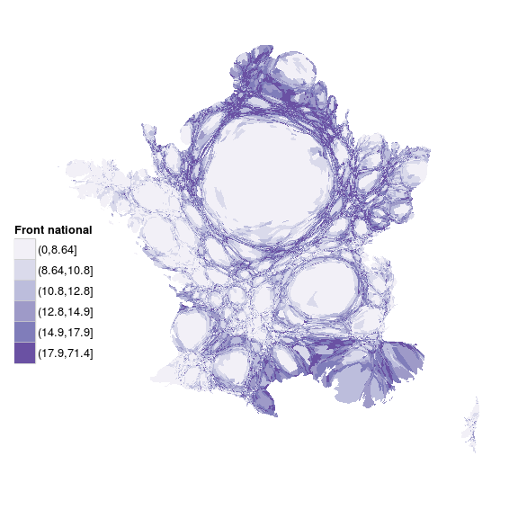
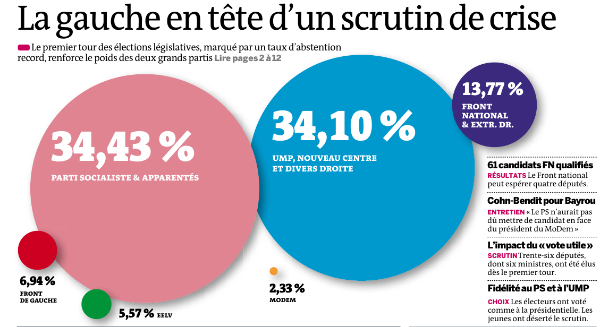
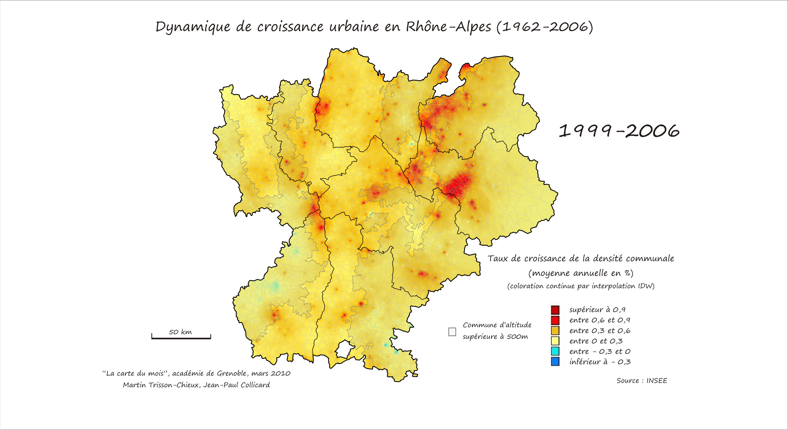
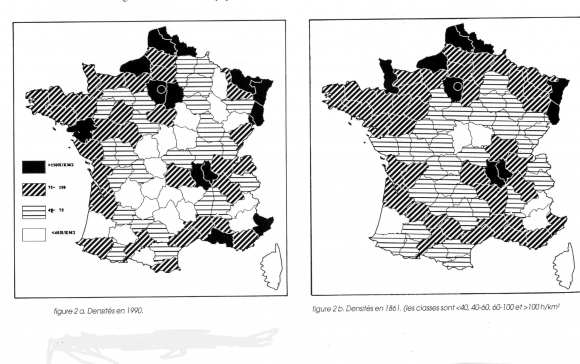
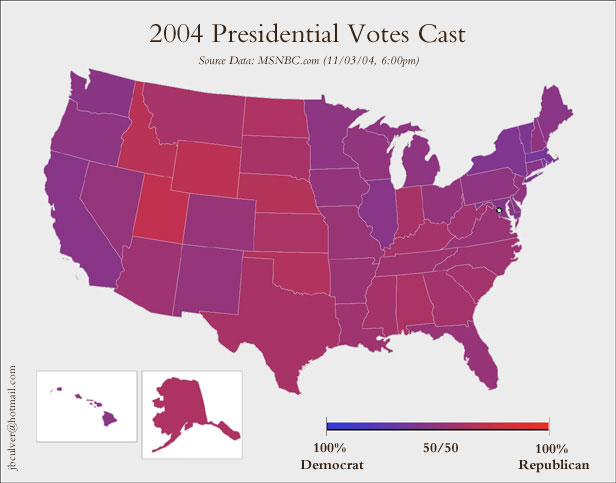
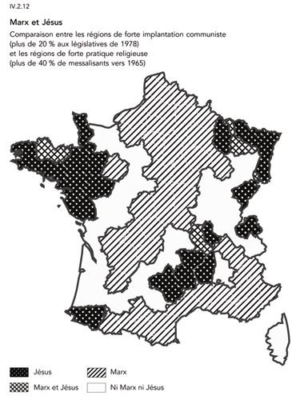

<script>
  (function(i,s,o,g,r,a,m){i['GoogleAnalyticsObject']=r;i[r]=i[r]||function(){
  (i[r].q=i[r].q||[]).push(arguments)},i[r].l=1*new Date();a=s.createElement(o),
  m=s.getElementsByTagName(o)[0];a.async=1;a.src=g;m.parentNode.insertBefore(a,m)
  })(window,document,'script','https://www.google-analytics.com/analytics.js','ga');

  ga('create', 'UA-80486908-1', 'auto');
  ga('send', 'pageview');

</script>

```{r knitr_init, echo=FALSE, cache=FALSE}
library(knitr)
library(rmdformats)

## Global options
options(max.print = "60")
opts_chunk$set(echo = TRUE,
	             cache = TRUE,
               prompt = FALSE,
               tidy = FALSE,
               comment = NA,
               message = TRUE,
               warning = TRUE)
opts_knit$set(width = 60)
```

# Préambule

Cette documentation est le fruit d'un travail collaboratif, réalisé par les participants à [la formation organisée par Open Data France et datactivi.st](http://www.datactivi.st/formation.html). Un grand merci à eux !

Elle accompagne les supports de formation suivants :

- les [slides de la première journée](./jour4.html)
- les [slides de la deuxième journée](./jour5.html)
- les [slides de la troisième journée](./jour6.html)

La documentation correspondant au module précédent, "Introduction aux outils d’analyse de données et à R", peut être [retrouvée ici](./index.html).

L'ensemble de ces matériaux peut être retrouvé sur le [repo github dédié](https://github.com/datactivist/IntroR_ODF).

L'ensemble de ces matériaux est placé, sauf mention contraire, sous [licence Creative Commons CC-BY-SA](https://creativecommons.org/licenses/by-sa/4.0/).

# Les matériaux nécessaires pour cette formation

- Une bonne connexion internet pour tous
- Un ordinateur par personne
- Toute la documentation de la formation : www.github.com/datactivist/introR_ODF

Pour le formateur : 

- préparer les démo

# Rappels

Le workflow de l'analyse de données :


Avant de commencer, on peut vérifier l'acquisition des compétences de la session précédente :

## Consolidation des acquis 

* sélectionner un jeu de données
* [l'importer](./index.html#importer-des-donnees)
* s’assurer que le jeu de données est “tidy”
* transformer le jeu de données comme nécessaire pour exploitation : recodage, transformation des variables, agrégation…

NB : 

* Dans `read_csv`, la variable `na` permet de spécifier comment sont désignés les valeurs nulles. Dans le cas des données sur les aides à la presse, `na = c("-", "Nc.")`
* Shift+Ctrl (ou Pomme sur Mac)+M pour `%>%`


# Les systèmes graphiques dans R

### Objectifs 

* Acquérir quelques principes de dataviz (Tufte, Wilkinson, Few…)  
    * [Tufte](https://fr.wikipedia.org/wiki/Edward_Tufte) : politologue qui a concentré une grande partie de ses travaux sur les enjeux de la visualisation, toujours actif, plusieurs de ses ouvrages font référence
    * [Wilkinson](https://en.wikipedia.org/wiki/Leland_Wilkinson)
    * [Few](https://www.perceptualedge.com/)
    * [Jacques Bertin](https://fr.wikipedia.org/wiki/Jacques_Bertin_(cartographe))
* Avoir une vision d’ensemble des systèmes graphiques dans R
* Se familiariser avec ggplot2 et la grammaire des graphiques
* Aller plus loin avec ggplot2 (petits multiples, visualisation de modèles, composition de dataviz complexes…)

## Panorama des systèmes graphiques de R

Au moins 3 systèmes graphiques dans R : 

* `base` graphics : mélange bas niveau/haut niveau, complexe, pas très cohérent, mais rapide et puissant
* `lattice` : haut niveau, a une grammaire, plus très utilisé
* `ggplot2` : haut niveau, grammaire cohérente, très puissant, très largement utilisé et imité

Langage haut niveau : abstrait, réalise des opérations standard en très peu de lignes / bas niveau :  se rapproche du langage machine et donc permet de programmer à un degré très avancé.

Ce sont des systèmes graphiques statiques. Pour visualisations interactives, d3.js est la fondation commune mais c'est un langage bas niveau de visualisation. 

Le site [HTML widgets](http://www.htmlwidgets.org) propose une série de librairies qui permettent de visualiser de manière interactive sous forme de graphes, cartes, réseaux… 

## `ggplot2` et la grammaire des graphiques

### La notion de grammaire de visualisation

`ggplot2` contient plusieurs notions essentielles qui en font une grammaire :  

* On part des données (`data`), on fait correspondre chaque variable qu'on veut représenter avec un élément précis de la visualisation. Ca s'appelle `aes`thetic mapping. 
* On a des couches (`layer`) qui se traduisent en deux dimensions : les géométries (`geom`) et les statistiques (`stat`). Un nuage de point : `geom` ; une régression linéaire : `stat`, plus avancé car on applique une transformation statistique. 
* On applique une échelle (`scale`), la manière dont on mappe une valeur à sa représentation graphique, avec un système de coordonnées (`coord`). Un système de coordonnées cartésiennes permet de déterminer la position d'un point dans un espace muni d'un repère cartésien.
* On peut générer des graphiques à la volée avec des facettes ou petits multiples (`facet`). Relation entre le niveau de vie et espérance de vie : une des solutions consiste à répliquer le graphique pour chaque continent. Petits multiples en forme de mosaique. 
* Un thème (`facet`) : codes couleurs, fonds…

Avec tous ces éléments, on peut faire n'importe quelle visualisation de données. C'est une grammaire, on peut générer toutes sortes de visualisation. 

## Premier exemple concret
 
`ggplot2` a été développé par [Hadley Wickham](http://hadley.nz/) il y a une dizaine d'années, du temps où le pipe `%>%` n'existait pas. Il a choisi à l'époque le `+` pour lier les instructions. 
 
 On travaille d'abord sur le jeu de données de la réserve parlementaire, déjà [rencontré auparavant](./index.html#un-autre-exemple) : 
 
 * On veut visualiser d'abord la description des subventions
 * On utilise l'histogramme : `geom_bar`
 * On fait une première visualisation en faisant un histogramme avec une barre pour chaque groupe politique mais peu lisible. 
 
```{r}
library(tidyverse)
library(stringr)
# devtools::install_github("hrbrmstr/hrbrthemes")
library(hrbrthemes)

reserve <- read_csv2("./reserve-assemblee-2013.csv", 
                     col_types = cols(.default = col_character(),
                                      MONTANT_SUBVENTION = col_integer(), 
                                      DATE_NAISSANCE_DEPUTE = col_date(format = ""), 
                                      DATE_DEBUT_MANDAT = col_date(format = ""), 
                                      DATE_FIN_MANDAT = col_date(format = ""), 
                                      NB_MANDATS = col_integer()))

reserve <- reserve %>% 
  # création d'un code circo sur deux caractères
  mutate(CodeCirco = str_pad(NUMERO_CIRCONSCRIPTION, 2, "left", "0")) %>% 
  mutate(CodeCirco = paste(ID_DEPARTEMENT, CodeCirco, sep = "-"))  # concaténation

  # barplot classique, avec le thème du package "hrbrthemes" pour des raisons esthétiques
reserve %>%
  ggplot(aes(x = GROUPE_SIGLE)) +
  geom_bar() +
  labs(x = "Groupe parlementaire",
       y = "Subventions distribuées",
       title = "La réserve parlementaire en 2013",
       subtitle = "Qui a distribué combien de subventions ?",
       caption = "Source : Assemblée nationale, données consolidées et enrichies par NosDonnees.fr") +
  theme_ipsum(grid = "Y")
```

 * On fait une deuxième visualisation sous la forme d'un histogramme en barre empilé (_stacked_) qui agrège les valeurs en une seule barre. 

```{r}

# barplot stacked avec couleur par groupe politique

reserve %>% 
  ggplot(aes(x = 1)) +
  geom_bar(aes(fill = GROUPE_SIGLE), position = position_fill()) +
  scale_fill_ipsum(name = "Groupe parlementaire") +
  labs(y = "Subventions distribuées", 
       title = "La réserve parlementaire en 2013",
       subtitle = "Qui a distribué combien de subventions ?",
       caption = "Source : Assemblée nationale, données consolidées\net enrichies par NosDonnees.fr") +
  theme_ipsum(grid = "Y") +
  scale_y_percent() +
  theme(axis.title.x = element_blank(),
        axis.text.x = element_blank(),
        axis.ticks.x = element_blank())

```

* On peut changer la couleur de chaque groupe politique (inefficace car on duplique une information, utile pour coloriser les groupes politiques par exemple verts en vert). Pour cela, on rajoute une valeur 
* On veut que chaque groupe politique ait une couleur propre. 
  * Pour que chaque valeur ait une couleur, il faut faire une échelle (`scale`). Pour les palettes de couleurs, on peut utiliser l'excellent site [color brewer](http://colorbrewer2.org) et la fonction `scale_fill_brewer` qui associe une palette à des valeurs. 


```{r}

# changement de scale à la main

reserve %>% 
  ggplot(aes(x = GROUPE_SIGLE)) +
  geom_bar(aes(fill = GROUPE_SIGLE)) +
  theme_ipsum(grid = "Y") +
  scale_fill_manual(values = c("ECOLO" = "dark green",
                               "GDR" = "dark red",
                               "NI" = "grey",
                               "RRDP" = "orange",
                               "SRC" = "pink",
                               "UDI" = "light blue",
                               "UMP" = "dark blue")) +
  labs(x = "Groupe parlementaire",
       y = "Subventions distribuées", 
       title = "La réserve parlementaire en 2013",
       subtitle = "Qui a distribué combien de subventions ?",
       caption = "Source : Assemblée nationale, données consolidées\net enrichies par NosDonnees.fr") 

```                           
                    

Quand on le fait de manière récurrente, on peut le stocker soit dans le script soit dans un script externe qu'on appellera ailleurs.

C'est ce qu'on appelle **factoriser son code** : stocker un script externe, ce qui permet de mieux le maintenir : on fait une amélioration à son code couleur .

`source()` : fonction pour appeler un script externe, avec l'argument `local=TRUE` afin que les objets chargés soient placés dans l'environnement depuis lequel le script est appelé.

Pour exporter une image, on a une fonction export en bas à droite dans Plots qui permet d'exporter en image, en PDF ou de copier dans le presse-papier. 

### Faire un graphique bivarié

=> Avec deux variables.

On va faire une transformation statistique (`stat`) des données.

### Exercice : connaitre la répartition du montant des subventions par groupe avec des `facets` 

```{r}
# facet par groupe parlementaire

reserve %>% 
  ggplot(aes(x = MONTANT_SUBVENTION)) +
  geom_histogram(bins = 30) +
  scale_x_log10(labels =  scales::comma) +
  facet_wrap(~ GROUPE_SIGLE, scales = "free_y") +
  labs(x = "Montant des subventions",
       y = "",
       title = "Des montants qui varient en fonction des groupes",
       subtitle = "Distribution des montants par groupe",
       caption = "Source : Assemblée nationale, données consolidées\net enrichies par NosDonnees.fr") +
  theme_ipsum()
```

## Les principales géométries
* `geom_point` : nuage de points
    * paramètres esthétique : taille, couleur, forme du point, transparence (paramètre alpha entre 0 et 1)...

On peut mapper autant de variables que d'esthétiques : 

* X
* Y
* couleur du point
* taille du point
* forme du point
* transparence…


Mais très vite ça devient illisible, il vaut mieux avoir recours à des facettes (petits multiples).  

### Les principales `geom`

* `geom_point`
* `geom_line`
* `geom_text` : ajoute un texte à chaque point ou à chaque groupe

Il y a des géométries qui contiennent des transformations statistiques :

* `geom_quantile`
    * le quantile, c'est diviser une variable en intervalles contenant le même nombre d'observations.
    * Médiane : 2 groupes, quartiles : 4 groupes de taille égale, décile : par 10... 
* `geom_histogram` : répartition d'une valeur continue
* `geom_density` : crée automatiquement une courbe de densité
* `geom_smooth`
    * courbe de tendance
    * droite de regression :
        * `geom_smooth(method = "lm")` 
* `geom_bar`
* et même `geom_map`pour faire de la cartographie…
    * Pas forcément le meilleur package pour en faire. 

### Les principaux `aes`thetics
* `x` : abscisses
* `y` : ordonnées
* `colour` : couleur
* `size` : taille
* line width `lwd`
* line type `lty`

# Modélisation, prédiction, machine learning…

On s'intéresse aujourd'hui à la partie modélisation du pipeline de données. Nous avons vu qu'il fallait souvent transformer les données pour pouvoir les visualiser. En visualisant des données, on a vu émerger des hypothèses mais la visualisation ne suffit pas à les confirmer. 

Il va falloir aller vers l'étape de modélisation pour confirmer ces hypothèses. Ce processus est itératif : on transforme, on visualise, on modélise puis on reprend ce processus jusqu'à avoir un modèle satisfaisant. 

La modélisation est le parent pauvre de la _hype_ actuelle autour des données. Souvent négligée dans les systèmes dits de "big data", on va ouvrir cette boîte noire aujourd'hui. R a été conçu pour faire de la modélisation de données donc on n'aura qu'un petit aperçu des possibilités de modélisation de R. 

Souvent cette étape de modélisation est ignorée mais il y a toujours un modèle des données : même un tableau croisé est une forme de modélisation. Il y en a toujours un, la question : est-ce qu'on l'explicite ou pas ?

Par exemple, quand on utilise la moyenne sur les revenus, on a des distributions très hétérogènes et la moyenne n'est pas un indicateur pertinent car très impacté par les valeurs extrêmes. 

### Objectifs :
* Appréhender la notion de modélisation
* La replacer dans un contexte plus large (machine learning ? Big data ?)
* Construire et analyser un modèle linéaire
* Construire et analyser un modèle logistique

## Qu'est ce qu'un modèle ?


Selon ce modèle dit ["Bread and Peace"](http://douglas-hibbs.com/background-information-on-bread-and-peace-voting-in-us-presidential-elections/), le résultat des élections est très lié au taux de croissance et au fait d'être en guerre. Le modèle combine en X le taux de croissance et les pertes militaires et en Y présente la part de voix du parti sortant. Si on est dans les 52% pour Clinton en 2016, selon ce modèle, l'élection à laquelle on a assisté est assez banale. 

Un modèle : ± la mise en rapport d'une variable en combinaison avec une ou plusieurs variables. Elle est asymétrique : il y a une valeur dépendante qu'on va chercher à expliquer ou à prédire et une ou des variable(s) indépendante(s) qui vont l'expliquer.

La notion de modélisation a une ambiguité. Il y a deux ambitions distinctes dans la modélisation : l'explication et un objectif de prédiction. Ces deux objectifs sont en tension : un bon modèle pour analyser ne sera pas forcément un bon modèle pour prédire. Idéalement, cela converge mais, dans la pratique, les deux objectifs sont pas forcément convergents. 

Beaucoup de modèles utilisés en machine learning sont une boite noire car on ne sait pas vraiment ce qu'il se passe dans le modèle. 

Les fondements mathématiques de la régression qu'on va utiliser aujourd'hui sont assez accessibles avec un niveau lycées de math. Dans beaucoup de systèmes de machine learning, il n'y a pas de modèle explicite.

Yann Le Cun dans la [leçon inaugurale de son cours au collège de France](http://www.college-de-france.fr/site/yann-lecun/inaugural-lecture-2016-02-04-18h00.htm) : "le deep learning, ça marche très bien mais on ne sait pas pourquoi ça marche". 

`GiGo : Garbage in, Garbage out`
Si les données sont de mauvaise qualité, on ne fera pas de bonnes analyses ou prédictions. Il y a certains problèmes de qualité qu'on sait gérer, des sources d'erreur qu'on sait contrôler (ex. la taille des échantillons). 

## Modéliser pour analyser

Un modèle simplifie la réalité, c'est un modèle réduit de la réalité dans lequel on étudie un petit nombre de facteurs. 

La critique "oui mais c'est plus compliqué que ça" est inhérente à la modélisation. 

> George Box : "Tous les modèles sont faux mais certains sont plus utiles que d'autres" 

L'objectif consiste à isoler le rôle de chaque variable. On peut complexifier certains modèles et prendre en compte le fait que des variables agissent en combinaison. 

On raisonne "toutes choses égales par ailleurs" (clause _ceteris paribus_), une formule affectionnée par les économistes, on  isole les effets "purs" de chaque variable. La critique de Simiand en sociologie : raisonner toutes choses égales par ailleurs, revient « à se demander comment vivrait un chameau si, restant chameau, il était transporté dans les régions polaires, et comment vivrait un renne, si, restant renne, il était transporté dans le Sahara ».

**Modéliser, c’est mettre en relation une variable expliquée (dépendante / prédite) et une ou plusieurs variables explicatives (indépendantes / prédicteurs)**.

$Y = f(X_1, X_2, X_3, …, X_n)$

Pour construire son modèle, il faut décider quelles sera ma variable expliquée et quelles seront mes variables explicatives.  

L’estimation du modèle consiste à estimer la valeur des paramètres (ou coefficients).

$Y = α + β_1X_1 + β_2X_2 + β_3X_3 + · · · + β_nX_n + ε$

$ε$ : marge d'erreur, bruit aléatoire dont on ne peut pas rendre compte. On suppose qu'il n'introduit pas de biais ce qui peut poser problème dans plusieurs cas. 

La construction de modèle relève généralement de l'artisanat, et moins de la science, c'est l'expérience de l'artisan qui permet de développer un modèle et rarement de la pure automatisation.

C'est uniquement quand on a construit le modèle qu'on parvient à tester des hypothèses, c'est un processus itératif. 

### Exemple sur le vote FN à Marseille

Exemple : on s’intéresse au vote FN à Marseille, par bureau de vote, lors des élections municipales de 2014, en fonction de la sociologie des bureaux de vote.

Vote FN = *f*(Composition socioprofessionnelle, population étrangère, taux de chômage, locataires HLM)


## Différence entre bayésien et fréquentiste 
D’un côté, les fréquentistes, pour qui on peut tester la véracité d’énoncés au moyen d’expériences et de tests statistiques. Chaque épreuve se déroule indépendamment des croyances ou connaissances préalables. 
Pour les bayésiens, au contraire, il y a beaucoup plus de doutes à avoir vis-à-vis de l’objectivation du monde, c’est une approche beaucoup moins naïve qui porte sur la quantification des croyances sur le monde, qui intègre les croyances ou connaissances qu’on a déjà. 

[](https://imgs.xkcd.com/comics/frequentists_vs_bayesians.png)
On ne sait pas si le détecteur de neutrino dit la vérité. Si les deux dés roulent sur 6 (il ment une fois sur 36), il ment. Si la probabilité (*p*) est plus faible que 5%, selon les méthodes fréquentistes en sciences sociales, le résultat n'est pas du au hasard et on considère que le résultat est solide.

Les bayésiens [contestent la méthode du `p value`](http://www.stat.columbia.edu/~gelman/research/published/signif4.pdf) ([l'association américaine de stats a demandé cet été d'abandonner ce critère](http://www.amstat.org/asa/files/pdfs/P-ValueStatement.pdf)) et vont toujours se poser la question : est-ce que je suis prêt à miser mon propre argent sur cette prédiction ?

> ([fuzzyjoin](https://github.com/dgrtwo/fuzzyjoin) pour joindre des tables avec une correspondance imprécise, type erreur de frappe ou même géolocalisation imprécise)

### Attention !

* Les modèles de régression linéaire supposent que les relations sont linéaires et additives.
* Les résidus sont supposés être normalement distribués.
* Les coefficients ne sont pas standardisés (on ne peut les comparer entre eux).
* Les coefficients s’interprètent relativement à l’unité de la variable dépendante.
* Les coefficients estiment l’effet d’une variable indépendante sur la variable dépendante toutes choses égales par ailleurs, c’est-à-dire en neutralisant l’effet des autres variables.
* La qualité globale du modèle peut être quantifié au travers du R2 , qui représente la part de variance (de la variable dépendante) expliquée.
* Pour les variables indépendantes catégoriques, on estime un coefficient par modalité, à l’exception de la première (baseline).

# Modèles linéaires sous R

## La fonction `lm`

La fonction lm permet d’estimer des linear models. Elle nécessite simplement le modèle, sous forme d’une formule, et un dataframe.

```{r, eval=FALSE}
modele1 <- lm(y ~ x1 + x2, data = data)
```

`lm` permet également d’estimer des modèles pondérés (argument weights) ou portant sur un sous-ensemble du jeu de données (argument subset).

## Exercice avec les données des bureaux de vote à Marseille

* télécharger le ZIP du [repo Github](https://github.com/datactivist/IntroR_ODF) en cliquant sur `clone or download`
* Créer un nouveau projet R dans le dossier où se situe le repo Github
* Copier les opérations d'import et de nettoyage des données

```{r}
# chargement des packages utiles

library(tidyverse)
library(stringr)

# Chargement des données 

bvINSEE <- read_csv2("./data/bvINSEE2012.csv")
# les identifiants des bureaux de vote sont codés différemment dans les deux jeux de données, on harmonise cela
bvINSEE <- bvINSEE %>% 
  mutate(BUREAU_ID = str_replace(BUREAU_ID, "_", ""))
marseille <- read_csv("./data/complet_par_bureaux.csv", 
                      col_types = cols(
                        .default = col_integer(),
                        bdv = col_character()
                      ))


# Nettoyage des données

marseille <- marseille %>%
  mutate( # on met les numéros de BV au bon format
    BUREAU_ID = paste0("132", str_sub(str_pad(bdv, 4, "left", "0"), 1, 2), str_pad(bdv, 4, "left", "0")),
    Inscrits = inscrits,
    Abstention = inscrits - Nuls - `Total Résultat`,
    Exprimés = `Total Résultat`,
    Diouf = `CHANGER LA DONNE`,
    AEI = `ALLIANCE ECOLOGISTE INDEPENDANTE`,
    POI = `LISTE D UNITE ET DE RESISTANCE CONTRE LA POLITIQUE DU GOUVERNEMENT ET DE L U.E SOUTENUE PAR LE POI`,
    Coppola = `MARSEILLE A GAUCHE, L HUMAIN D ABORD DANS NOTRE VILLE`,
    Assante = `MARSEILLE A VIVRE`,
    Ravier = `MARSEILLE BLEU MARINE`,
    Gaudin = `MARSEILLE EN AVANT AVEC JEAN-CLAUDE GAUDIN`,
    MarseilleEnsemble = `MARSEILLE ENSEMBLE`,
    Persia = `MARSEILLE J Y CROIS`,
    MarseillePopulaire = `MARSEILLE POPULAIRE`,
    MarseilleUnie = `MARSEILLE UNIE`,
    Mennucci = `UN NOUVEAU CAP POUR LES MARSEILLAIS AVEC PATRICK MENNUCCI`,
    Qualite = `UNE QUALITE DE VIE POUR TOUS`,
    UnionMarseille = `UNION POUR MARSEILLE`
  )
# quand une cellule est vide : mettre une valeur égale à zéro
marseille[is.na(marseille)] <- 0

# On transforme les résultats en % des inscrits

marseille <- marseille %>% 
  mutate_at(vars(Nuls, Abstention, Diouf, Coppola, Ravier, Gaudin, Mennucci), 
            funs(. / Inscrits * 100))

# on fusionne les résultats électoraux avec les données de l'INSEE

marseille <- left_join(marseille, bvINSEE, by = "BUREAU_ID")

# on transforme les données INSEE en %

marseille <- marseille %>%
  mutate(CS1 = C09_ACT1564_CS1 / P09_POP1564 * 100,
         CS2 = C09_ACT1564_CS2 / P09_POP1564 * 100,
         CS3 = C09_ACT1564_CS3 / P09_POP1564 * 100,
         CS4 = C09_ACT1564_CS4 / P09_POP1564 * 100,
         CS5 = C09_ACT1564_CS5 / P09_POP1564 * 100,
         CS6 = C09_ACT1564_CS6 / P09_POP1564 * 100,
         etrangers = P09_POP_ETR / P09_POP * 100,
         chomage = P09_CHOM1564 / P09_POP1564 * 100,
         HLM = P09_NPER_RP_LOCHLMV / P09_POP * 100)
```

* estimer le modèle

```{r}
modele1 <- lm(Ravier ~ CS2 + CS3 + CS4 + CS5 + CS6 + etrangers + chomage + HLM, data = marseille)
summary(modele1)
```

coefficients : 
* estimate : la valeur 
* error : erreur-type, moyenne des écarts à l'estimation, permet de calculer l'intervale de confiance 
* t value : ne pas en tenir compte
* Pr(>|t|) : p value, contesté
* Residual standard error : erreur-type des résidus (~erreur moyenne des prédictions)
* Multiple R-squared : $R^2$ multiple
* Adjusted R-squared : $R^2$ multiple ajusté en fonction du nombre de variables indépendantes.

* on regarde les résultats du modèle dans une interface plus lisible
    * On va utiliser la librairie `texreg` pour cela. 
    * Il faut l'installer : 
    
```{r} 
# install.packages("texreg")
library(texreg)
```
* on obtient le tableau suivant dans lequel on voit directement les coefficients et leur erreur standard : 

```{r, results='asis'}
htmlreg(modele1)
```

* on peut après analyser un élément du modèle, par exemple les résidus : l'écart entre la réalité et le modèle 

On peut également remplacer les erreurs standard par des intervalles de confiance, avec l'option `ci.force` dans `scrennreg` (resp. `texreg` et `htmlreg` si on veut du latex ou du html en sortie). 

```{r, results='asis'}
htmlreg(modele1, ci.force = TRUE)
```

## `modelr`et `broom`

Hadley Wickham, encore lui, a développé cette librarie qui facilite une partie du travail de modélisation. 

`modelr` permet de manipuler des modèles avec le pipe, très récent, devrait évoluer. Voir http://r4ds.had.co.nz/model-basics.html

`broom` plus ancien, permet de gérer de nombreux modèles à la fois. Interface simple et pratique qui permet de transformer des modèles en un jeu de données tidy : https://cran.r-project.org/web/packages/broom/vignettes/broom.html. Voir également http://r4ds.had.co.nz/many-models.html. 

## Les modèles généralisés

On prend la logique d'un modèle linéaire et on va la généraliser. 

Modèle logistique : valable dans le cas de variable binaire (homme/femme, votant/abstentionniste, en bonne santé/malade...). On modélise non pas la valeur, mais la probabilité d'une valeur (ex: proba de dire oui)

La syntaxe est comparable à celle de `lm` :

```{r, eval = FALSE}
modelegen1 <-  glm(y ~ x1 + x2, data = data)
```

avec éventuellement un argument `family` pour indiquer le type de fonction-lien *f* (par défaut, c'est un modèle logistique). Par exemple, pour des données de décompte, on modélise *y* comme suivant une [loi de Poisson](https://fr.wikipedia.org/wiki/Loi_de_Poisson), avec une fonction-lien qui est le logarithme : 

```{r, eval=FALSE}
modelegen2 <- glm(y ~ x1 + x2, family = poisson(link = "log"), data = data)
```

# Cartographie

Pour un aperçu du potentiel cartographique de R, voir l'exemple de la [cartographie des électeurs FN à Marseille](https://joelgombin.github.io/makingof.html) par Joël. 

### Avantages de R pour la cartographie

* un workflow intégré
* un workflow reproductible
* une convergence des paradigmes de carto “statique” (print) et “dynamique” (web): on utilise le même code quelque soit le support (avce le package `tmap`)
* l’intégration dans des apps interactives, voir l'exemple de [Superzip](http://shiny.rstudio.com/gallery/superzip-example.html) réalisé en quelques [centaines de lignes de codes](https://github.com/rstudio/shiny-examples/tree/master/063-superzip-example)

### Quelques pistes/ressources

* des capacités de base grâce à [`sp`](https://cran.r-project.org/web/packages/sp/vignettes/intro_sp.pdf)
* des capacités SIG grâce à `maptools`, `rgdal` et `rgeos`
* l'avenir : l'intégration du standard des [`simple features` dans R](https://github.com/edzer/sfr)
* des packages de cartographie de haut niveau : [`cartography`](https://rgeomatic.hypotheses.org/659) (réalisé par des Français) et [`tmap`](https://cran.r-project.org/web/packages/tmap/vignettes/tmap-nutshell.html) (plus largement adopté, moins documenté)
* des packages de cartographie interactive/web : [`leaflet`](https://rstudio.github.io/leaflet/), [`mapview`](http://environmentalinformatics-marburg.github.io/mapview/introduction.html)

## Notions de cartographie

### Qu’est-ce qu’une carte ?

“Une carte est une représentation géométrique plane simplifiée et conventionnelle de tout ou partie de la surface terrestre, et cela dans un rapport de similitude convenable qu’on appelle échelle.” (F. Joly, 1976)

Référence : Béguin et Pumain, 2014 (3e éd.)

### La notion de projection

La projection est l’outil mathématique qui permet de passer du géoïde représentant la Terre à une représentation plane.

Des projections sont dites *conformes* (Mercator, Lambert) : inventées pour la navigation maritime, les directions sur la carte sont justes et les lignes parallèles sur la terre sont bien parallèles sur la carte. Les surfaces sont en revanche très déformées quand on s'approche des pôles. 

L'IGN et beaucoup d'institutions françaises sont projetées en Lambert 93 ; une projection centrée sur la France qui respecte plus la conformité et l'équivalence sur l'espace français (Mercator pour l'ensemble du globe). 

Il y aussi des projections *équivalentes* (Eckert IV, Gall) qui représentent les surfaces terrestres en équivalence avec la superficie du territoire. 

Dans tous les cas, il y a toujours une déformation ! Il faut faire un choix entre une représentation conforme (parallélisme des directions) et équivalente (superficie des polygones). 

Les coordonnées géographiques sont exprimées en longitude et latitude. Les unités peuvent être des degrés ou des grades. La projection transforme les coordonnées géographiques en coordonnées x/y.

[Cet outil](https://bl.ocks.org/syntagmatic/ba569633d51ebec6ec6e) par exemple permet de visualiser différents systèmes de projection.

#### Un peu d'humour avec les projections

The West Wing, la série qui arrive à faire un sketch drôle sur les projections géographiques :

<iframe width="560" height="315" src="https://www.youtube.com/embed/vVX-PrBRtTY" frameborder="0" allowfullscreen></iframe>

XKCD a aussi illustré les différents systèmes de projection :

[](https://xkcd.com/977/)

### L’échelle

L’échelle d’une carte représente le rapport d’une distance mesurée sur la carte à sa valeur réelle sur le terrain.

Échelle	1 cm représente

1/10000 100 m
1/25000	250m
1/50000	500m
1/100000	1km
1/1000000	10km

Attention : “petite échelle” = grande superficie représentée ; “grande échelle” = petite superficie représentée

L’échelle est déformée à distance du centre de projection (équateur pour Mercator).

### La généralisation

“L’opération qui par sélection, schématisation et harmonisation reconstitue sur une carte la réalité de la surface représentée dans ses traits essentiels en fonction du but de la carte, de son thème, de son échelle et des particularités de la région cartographiée.”


### La sélection

Quelles couches d’information représenter ? 
Ni trop (surcharge d’information, à la Google Maps) ni trop peu (rendre la carte intelligible au lecteur).

Le style [“toner”](http://maps.stamen.com/toner/#12/37.7706/-122.3782) peut être utile pour trouver cet équilibre, en cartographie thématique. Il représente essentiellement les grands axes de circulation et les espaces verts. 

### La schématisation

Opération de simplification, qui peut être structurale (tracés) ou conceptuelle (schéma).

Attention : on peut simplifier à partir de données détaillées, mais on ne peut pas faire l’inverse ! Donc toujours veiller à conserver les données dans leur forme la plus détaillée.

### Le fond de carte

Le fond de carte est constitué des éléments repris d’une carte topographique (par exemple de l’IGN) et utilisés pour une carte thématique.

“Carte reproduite totalement ou partiellement, en une ou plusieurs couleurs souvent atténuées, servant de repère pour le report en surcharge de phénomènes localisables déterminés” (CFC). 

Peut concerner les découpages administratifs, le réseau routier, hydrographique, les courbes de niveau, etc.

#### Les sources de fonds de carte

Traditionnellement, en France : l’IGN.

De plus en plus : Google Maps ou Open Street Map. 

Des prestataires créent des styles très variés comme Stamen : [Toner](http://maps.stamen.com/toner/#12/48.8974/2.2017) ou [Watercolor](http://maps.stamen.com/watercolor/#12/48.8974/2.2017) comme une aquarelle, un peu artistique mais peut fonctionner avec des points. 

### Vecteur ou raster

Comment stocker et représenter l’information géographique ?

“Mode raster” : il s’agit d’une image, découpée en pixels. Des valeurs sont attribués aux pixels. Ex : photo satellite.

“Mode vecteur” : on utilise des objets géométriques (lignes, points, polygones…) auxquels sont associés 
des attributs. Ex : carte d’un réseau de transports.
Généralement, les vecteurs sont économiques en bande passante, mais parfois c'est l'inverse si on a beaucoup d'informations.

La révolution fondamentale d'OSM : auparavant données géo chasse gardée des instituts nationaux et des géants économiques du secteur, avec OSM les vecteurs sont libres => énorme différence, surtout dans les pays en développement. 

<iframe width="800" height="600" frameborder="0" scrolling="no" marginheight="0" marginwidth="0" src="https://www.openstreetmap.org/export/embed.html?bbox=2.3314136266708374%2C48.866987337550164%2C2.33908474445343%2C48.87019135286425&amp;layer=transportmap" style="border: 1px solid black"></iframe>

### Cartes choroplèthes

Une carte choroplèthe est une carte thématique où les régions sont colorées ou remplies d’un motif qui montre une mesure statistique, tels la densité de population ou le revenu par habitant. Ce type de carte facilite la comparaison d’une mesure statistique d’une région à l’autre ou montre la variabilité de celle-ci pour une région donnée.

### Cartes en anamorphose ou cartogramme

“La cartographie en anamorphose a pour but d’adapter la forme de la carte non pas à la réalité physique mais plutôt à la réalité perçue.” (Langlois et Denain, 1996)

On déforme le fond de carte en fonction d’une variable quantitative (voire arbitrairement).

[](http://www.slate.fr/france/87669/cartes-europeennes-2014)

### Le langage cartographique 

[Bertin, 1965](http://classiques.uqac.ca/collection_methodologie/bertin_jacques/representations_visuelles_info/representations_visuelles_info_texte.html) : travail sur la sémiologie graphique. La carte, comme le graphique, permettent de percevoir *en même temps* trois informations (X,Y,Z).

Mais pour que cette communication soit efficace, il faut respecter un langage précis et ses règles. 

Assez comparable à la grammaire des graphiques.

### Les composantes du langage cartographique 

- les signes graphiques élémentaires : point, trait, tâche (aplat). 
- le figuré cartographique : combinaison de signes graphiques élémentaires.
- l'implantation graphique : manière d'appliquer le figuré sur la carte (ponctuelle, linéaire ou zonale).
- les variables visuelles : façon de faire varier les signes graphiques. Il y en a sept.

#### Les variables visuelles 

- forme
- taille
- couleur 
- valeur 
- orientation
- texture-structure (trame)
- grain

#### La forme 

- Ne transcrit qu'une information qualitative. 
- Veiller à ne pas utiliser trop de formes différentes, sinon cela devient illisible (< 10)
- Utilisée dans les trois types d'implantation graphique. En implantation zonale => texture.

#### La taille 

- longueur/hauteur/surface/volume
- bonne perception visuelle par l'œil
- rapport de proportionnalité entre information quantitative représentée et la forme
- attention à respecter cette proportionnalité ! 
- la taille est plus facile à estimer que la surface ou le volume

Un exemple d'utilisation incorrecte (non-proportionnelle) de la taille :



- Le cartogramme (anamorphose) comme cas particulier de l'utilisation de la taille.
- [Créer un fonds de carte en anamorphose](http://scapetoad.choros.ch/)
- [Réaliser un cartogramme en javascript](http://prag.ma/code/d3-cartogram/)

#### La couleur

* fort pouvoir différentiel
* esthétique
* trois propriétés :
    + ton 
    + saturation
    + intensité
  
- En général, on utilise un seul ton et on joue sur l'intensité.
- Parfois, par exemple pour représenter une variation, on peut jouer sur deux échelles de tons
- Si on représente une variable qualitative, on utilise autant de tons que de catégories
- Penser aux daltoniens !
    - http://colororacle.cartography.ch
- Penser au support (web, papier...)
- Des palettes de couleur de référence : [colorbrewer2.org](http://colorbrewer2.org/) par exemple
- Un autre outil de construction de palette de couleur : [vis4.net/labs/multihue](https://vis4.net/labs/multihue/)
- C'est la variable qu'on utilise le plus en cartographie thématique.


#### La valeur 

- Valeur : rapport entre quantités totales de noir et de blanc perçues dans une surface donnée (cf. aussi "gris typographique"). 
- Peut passer par une trame 
- Peut concerner une couleur (un ton)
- En général, on utilise des classes (max 6/7)
- Mais parfois, coloration continue


Un exemple de coloration continue :


Des cartes _old school_ de densité, qui utilisent une trame :



Une autre coloration continue (pas très lisible parce qu'elle utilise trop de teintes [hues]) :



#### Le grain 

- agrandissement ou réduction d'une texture/structure
- pas très utilisé, car mal perçu par l'œil humain

#### L'orientation 

- Angle d'un figuré linéaire
- Pour variable qualitative, moins utilisé aujourd'hui

#### L'orientation 

Un exemple d'utilisation par Todd et Le Bras :



### Distribution et découpage en classes des variables quantitatives

Discrétisation : découper une variable continue en classes

Ce découpage n’est pas neutre, et ne peut être décidé indépendamment de la distribution de la variable représentée

Voir [cet article](http://www.persee.fr/web/revues/home/prescript/article/espos_0755-7809_2000_num_18_1_1930).

Un [moyen sympa](http://franceo3.geoclip.fr/index.php?profil=FV#z=-349737,6562730,1033057,513716;l=fr;i=euro14.pt_lfn;v=map12) de jouer avec les différentes méthodes de discrétisation.

### Et concrètement, on fait comment ?

De très nombreux outils existent. QGIS est en train de s’imposer comme le SIG de référence dans le monde du libre. Malheureusement, en cartographie pure, aucune solution de référence ne permet de traiter aisément tous les cas de figure (vectoriel/raster ; print/web, etc.). En ce qui concerne la carto web, pas vraiment de solution de référence pour l’heure.

R n’est pas fait (du tout) au départ pour faire de la carto, mais offre aujourd’hui un workflow complet allant du nettoyage des données à leur représentation cartographique en passant par le nettoyage, l’analyse et la transformation des données.

## R et les données spatiales

### Un objet spatial, c’est quoi ?

* une collection de géométries (points, lignes, polygones), regroupées en couches (layers)
* une table attributaire (des données)
* un identifiant unique pour faire le lien entre les deux !
* si les choses sont bien faites, une projection. Généralement en France, Lambert 93 ou Mercator. 

### Formats spatiaux

* le plus répandu, la référence : le shapefile (format défini par ESRI). 
    * Pose pas mal de problèmes : plusieurs fichiers (.shp, .dbf., .prj, .shx, etc.) ; nom des variables limité à 10 caractères ; pas de valeurs manquantes ; pas plus de 255 variables ; pas de fichiers de plus de 2GB…
* le format promu par Google : le KML
    * lancé pour Google Earth
    * Assez peu utilisé
* un standard largement utilisé et récemment porté sous R : les [`simple features`](https://cran.r-project.org/web/packages/sf/vignettes/sf1.html)
* le nouveau standard de facto en ligne : [GeoJSON](https://github.com/ropensci/geojsonio) (sous-ensemble des simple features)
* une version améliorée et topologique du GeoJSON : le topoJSON
    * topologique signifie que, pour deux polygones voisins, la frontière commune est décrite par les deux polygones dans les formats non topologiques ; en topoJSON, encodé que c'est une seule frontière, préférable d'un point de vue computationnel. 

Il existe des outils libres pour passer d’un format à l’autre, en particulier OGR/GDAL. R possède des surcouches de ces librairies.

### Et dans R ?

Plusieurs classes (type d'objet et méthodes associées) dans R pour représenter les objets spatiaux. La plus importante (et le seul qu’on utilisera) provient de la librairie `sp` et est `SpatialPolygonsDataFrame` (il existe aussi `SpatialPoints*` et `SpatialLines*`).

On peut créer un objet `SpatialPolygonsDataFrame` à la main, mais en réalité on ne le fait jamais, on importe un shapefile (ou autre) dans R. Plusieurs fonctions pour cela ; la meilleure est `readOGR`, dans le package `rgdal`.

```{r message=FALSE, warning=FALSE}
#install.packages("sp")
#install.packages("rgdal")

library(sp)
library(rgdal)

departements <- readOGR("./data/departements", "DEPARTEMENT", stringsAsFactors = FALSE)
summary(departements)
```

Il faut mettre tous les fichiers du ShapeFile dans le dossier concerné (ici `departements`). 

Les objets `SpatialPolygonsDataFrame` sont complexes, mais comprennent pour simplifier d'une part les polygones (auxquels on accède directement : `departements[1,]`) et d'autre part le `dataframe`, qui est un `slot` de l'objet :

```{r message=FALSE, warning=FALSE}
summary(departements@data)
departements@data %>%
  filter(NOM_REGION %in% "ILE-DE-FRANCE")
```

On peut ainsi sélectionner une partie seulement d'un `SpatialPolygonsDataFrame`, en fonction de données de la table attributaire. 

Nouveau package pour utiliser la syntaxe du `tidyverse` avec `sp` : https://cran.r-project.org/web/packages/spdplyr/vignettes/spdplyr.html

```{r message=FALSE, warning=FALSE}
library(spdplyr)
iledefrance <- departements %>% 
  filter(NOM_REGION %in% "ILE-DE-FRANCE")
```

On peut aisément visualiser les objets spatiaux au moyen de la fonction `plot` :

```{r message=FALSE, warning=FALSE}
plot(departements)

## ou :
## departements %>% plot()

```

Mais aussi grâce au package `mapview` :

```{r message=FALSE, warning=FALSE}
library(mapview)
mapview(departements)
mapview(departements, zcol = "CODE_REG", burst = TRUE)
```
