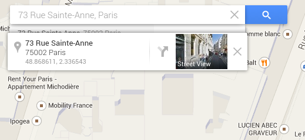
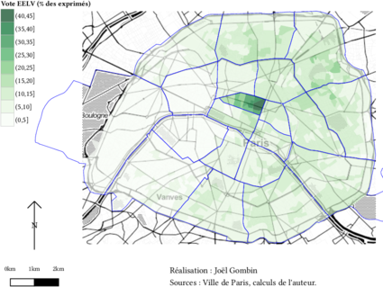

  
  ## Introduction à R, le couteau suisse de la data science 
  
  
  <p></p>
  <p></p>
  Jour 6
<p></p><p></p><p>
  Joël Gombin et Samuel Goëta (datactivi.st)
</p>
  <p>
  Retrouvez les matériaux sur : [www.github.com/datactivist/IntroR_ODF](www.github.com/datactivist/IntroR_ODF)
</p>
  
  <p>
  Pad collaboratif : https://frama.link/formationR_pad4
</p>
  
## Ce qu'on a déjà appris 
  
- l'écosystème dans lequel s'inscrit R
- importer des données
- préparer des *tidy data*
- transformer les données
- fusionner des jeux de données
- pivoter un je de données
- agréger un jeu de données
- visualiser des données
- modéliser des données

## Ce qu'on a déjà appris 

```{r, echo = FALSE, out.width='90%', fig.align='center'}
knitr::include_graphics("./img/data-science-model.png")
```

## Consolidation des acquis

Exercice : importer un jeu de données, le nettoyer/préparer, représenter graphiquement la relation entre trois variables, la tester dans le cadre d'un modèle

# Un exemple

## R, un potentiel cartographique énorme

http://joelgombin.github.io/makingof.html

## Des avantages

- un workflow intégré
- un workflow reproductible
- une convergence des paradigmes de carto "statique" (print) et "dynamique" (web)
- l'intégration dans des apps : http://shiny.rstudio.com/gallery/superzip-example.html

## Quelques pistes/ressources

- des capacités de base grâce à `sp`
- des capacités SIG grâce à `maptools`, `rgdal` et `rgeos`
- des packages de cartographie de haut niveau : `cartography` et `tmap` 
- des packages de cartographie interactive/web : `leaflet`, `mapview`, 

# Notions de cartographie 

## Qu'est-ce qu'une carte ? 

"Une carte est une représentation géométrique plane simplifiée et conventionnelle de tout ou partie de la surface terrestre, et cela dans un rapport de similitude convenable qu'on appelle échelle." (F. Joly, 1976)


Référence : [Béguin et Pumain, 2014 (3e éd.)](http://www.persee.fr/web/revues/home/prescript/article/espos_0755-7809_1998_num_16_1_1827_t1_0119_0000_2)

## La notion de projection 

La projection est l'outil mathématique qui permet de passer du géoïde représentant la Terre à une représentation plane. 

Projections conformes (Mercator, Lambert) ou équivalentes (Eckert IV, Gall). Il y a toujours une déformation !

Les coordonnées géographiques sont exprimées en longitude et latitude. Les unités peuvent être des degrés ou des grades. La projection transforme les coordonnées géographiques en coordonnées x/y. 

## La notion de projection 

Exemple de coordonnées géographiques :



## La notion de projection 

Un truc cool pour jouer avec les différentes projections :

http://bl.ocks.org/mbostock/raw/3711652/

## La notion de projection 

_The West Wing_, la série qui arrive à faire un sketch drôle sur les projections géographiques :

<iframe width="560" height="315" src="https://www.youtube.com/embed/vVX-PrBRtTY" frameborder="0" allowfullscreen></iframe>

## L'échelle 

L'échelle d'une carte représente le rapport d'une distance mesurée sur la carte à sa valeur réelle sur le terrain.

Échelle        | 1 cm représente
---------------|----------------
1/10000        |100 m
1/25000        |250m
1/50000        |500m
1/100000       |1km
1/1000000      |10km


## L'échelle 

Attention : "petite échelle" = grande superficie représentée
"grande échelle" = petite superficie représentée

L'échelle est déformée à distance du centre de projection (équateur pour Mercator)

Échelle numérique et échelle graphique

## 



## La généralisation 

"L'opération qui par sélection, schématisation et harmonisation reconstitue sur une carte la réalité de la surface représentée dans ses traits essentiels en fonction du but de la carte, de son thème, de son échelle et des particularités de la région cartographiée."

## La sélection 

Quelles couches d'information représenter ? Ni trop (surcharge d'information, à la Google Maps) ni trop peu (rendre la carte intelligible au lecteur).

Le [style "toner"](http://maps.stamen.com/toner/#12/37.7706/-122.3782) peut être utile pour trouver cet équilibre, en cartographie thématique :

## 


## La schématisation 

Opération de simplification, qui peut être structurale (tracés) ou conceptuelle (schéma). 

Attention : on peut simplifier à partir de données détaillées, mais on ne peut pas faire l'inverse ! Donc toujours veiller à conserver les données dans leur forme la plus détaillée. 


## Le fond de carte 

Le fond de carte est constitué des éléments repris d'une carte topographique (par exemple de l'IGN) et utilisés pour une carte thématique.

"Carte reproduite totalement ou partiellement, en une ou plusieurs couleurs souvent atténuées, servant de repère pour le report en surcharge de phénomènes localisables déterminés" (CFC). Peut concerner les découpages administratifs, le réseau routier, hydrographique, les courbes de niveau, etc. 


## Les sources de fonds de carte 

Traditionnellement, en France : l'IGN.

De plus en plus : Google Maps, Open Street Map, Stamen...

##

<iframe src='https://maps.stamen.com/toner/#12/48.8974/2.2017' width='800' height='600'></iframe>

##

<iframe src='https://maps.stamen.com/watercolor/#12/48.8974/2.2017' width='800' height='600'></iframe>

## Vecteur ou raster 

Comment stocker et représenter l'information géographique ?

- "Mode raster" : il s'agit d'une image, découpée en pixels. Des valeurs sont attribués aux pixels. Ex : photo satellite.
- "Mode vecteur" : on utilise des objets géométriques (lignes, points, polygones...) auxquels sont associés des attributs. Ex : carte d'un réseau de transports.

## 


<iframe width="800" height="600" frameborder="0" scrolling="no" marginheight="0" marginwidth="0" src="http://www.openstreetmap.org/export/embed.html?bbox=2.3314136266708374%2C48.866987337550164%2C2.33908474445343%2C48.87019135286425&amp;layer=transportmap" style="border: 1px solid black"></iframe>

## 

<iframe src='http://www.comeetie.fr/galerie/francepixels/#' width="800" height="600"></iframe><br/><small><a href="http://www.comeetie.fr/galerie/francepixels/#">Voir la source</a></small>

## Cartes choroplèthes 

Une carte choroplèthe est une carte thématique où les régions sont colorées ou remplies d'un motif qui montre une mesure statistique, tels la densité de population ou le revenu par habitant. Ce type de carte facilite la comparaison d'une mesure statistique d'une région à l'autre ou montre la variabilité de celle-ci pour une région donnée.

## Cartes en anamorphose ou cartogramme 

"La cartographie en anamorphose a pour but d'adapter la forme de la carte non pas à la réalité physique mais plutôt à la réalité perçue." [(Langlois et Denain, 1996)](http://cybergeo.revues.org/129) 

On déforme le fond de carte en fonction d'une variable quantitative (voire arbitrairement).

##

[](http://www.slate.fr/france/87669/cartes-europeennes-2014)

## Le langage cartographique 

[Bertin, 1965](http://classiques.uqac.ca/collection_methodologie/bertin_jacques/representations_visuelles_info/representations_visuelles_info_texte.html) : travail sur la sémiologie graphique. La carte, comme le graphique, permettent de percevoir *en même temps* trois informations (X,Y,Z).

Mais pour que cette communication soit efficace, il faut respecter un langage précis et ses règles. 

Assez comparable à la grammaire des graphiques.

## Les composantes du langage cartographique 

- les signes graphiques élémentaires : point, trait, tâche (aplat). 
- le figuré cartographique : combinaison de signes graphiques élémentaires.
- l'implantation graphique : manière d'appliquer le figuré sur la carte (ponctuelle, linéaire ou zonale).
- les variables visuelles : façon de faire varier les signes graphiques. Il y en a sept.

## Les variables visuelles 

- forme
- taille
- couleur 
- valeur 
- orientation
- texture-structure (trame)
- grain

## La forme 

- Ne transcrit qu'une information qualitative. 
- Veiller à ne pas utiliser trop de formes différentes, sinon cela devient illisible (< 10)
- Utilisée dans les trois types d'implantation graphique. En implantation zonale => texture.

## La taille 

- longueur/hauteur/surface/volume
- bonne perception visuelle par l'œil
- rapport de proportionnalité entre information quantitative représentée et la forme
- attention à respecter cette proportionnalité ! 
- la taille est plus facile à estimer que la surface ou le volume

Un exemple d'utilisation incorrecte (non-proportionnelle) de la taille :

## La taille 


## La taille 

- Le cartogramme (anamorphose) comme cas particulier de l'utilisation de la taille.
- [Créer un fonds de carte en anamorphose](http://scapetoad.choros.ch/)
- [Réaliser un cartogramme en javascript](http://prag.ma/code/d3-cartogram/)

## La couleur 

* fort pouvoir différentiel
* esthétique
* trois propriétés :
    + ton 
    + saturation
    + intensité
  
## La couleur

<iframe src='http://hslpicker.com/' width='800px' height='500px'></iframe>

## La couleur

- En général, on utilise un seul ton et on joue sur l'intensité.

<iframe src='./img/grenobleAbstention.html' width='700px' height='600px'></iframe>

## La couleur

- Parfois, par exemple pour représenter une variation, on peut jouer sur deux échelles de tons

<iframe src='./img/amiensProgFN.html' width='700px' height='600px'></iframe>

## La couleur

- Si on représente une variable qualitative, on utilise autant de tons que de catégories

<iframe src='./img/comm.couleur.html' width='700px' height='500px'></iframe>

## La couleur 

- Penser aux daltoniens !
- Penser au support (web, papier...)
- Des palettes de couleur de référence : [colorbrewer2.org](http://colorbrewer2.org/) par exemple
- Un autre outil de construction de palette de couleur : [vis4.net/labs/multihue](https://vis4.net/labs/multihue/)
- C'est la variable qu'on utilise le plus en cartographie thématique.
